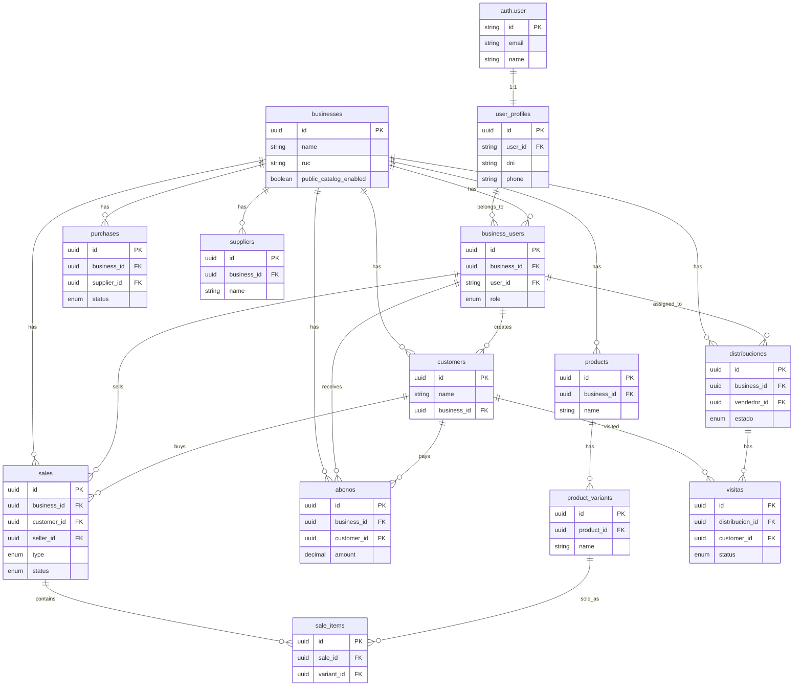

# Avileo Database

> PostgreSQL database schema with Drizzle ORM, designed for multi-tenancy.

## Table of Contents

1. [Database Architecture](#database-architecture)
2. [Schema Structure](#schema-structure)
3. [Table Reference](#table-reference)
4. [Enums](#enums)
5. [Relations](#relations)
6. [Multi-Tenancy Pattern](#multi-tenancy-pattern)
7. [Better Auth Integration](#better-auth-integration)

---

## Database Architecture

### Design Principles

1. **Multi-Tenancy**: Users can belong to multiple businesses
2. **Better Auth**: Authentication delegated to Better Auth tables
3. **Soft Deletes**: `is_active` boolean for logical deletion
4. **Audit Trail**: `created_at`, `updated_at` on all tables
5. **Unified Sales**: Single `sales` table for both instant sales and pre-orders

### Technology Stack

| Component | Technology |
|-----------|------------|
| Database | PostgreSQL 16.x (Neon) |
| ORM | Drizzle ORM |
| Migrations | Drizzle Kit |
| Connection | `sslmode=require` for Neon |

---

## Schema Structure

### File Organization

```
packages/backend/src/db/schema/
├── enums.ts                    # PostgreSQL enum definitions
├── auth.ts                     # Better Auth tables (re-export)
├── user-profiles.ts            # User profile data
├── businesses.ts               # Businesses and business_users
├── customers.ts                # Customer management
├── customer-tags.ts            # Customer-tag relationships
├── customer-groups.ts          # Customer groups
├── customer-group-members.ts   # Group memberships
├── tags.ts                     # Customer tags
├── sales.ts                    # Sales and sale_items (unified)
├── sale-tokens.ts              # Public sale access tokens
├── payment-tokens.ts           # Payment access tokens
├── payments.ts                 # Abonos (debt payments)
├── products.ts                 # Product catalog
├── inventory.ts                # Products, variants, distributions
├── product-units.ts            # Configurable product units
├── purchases.ts                # Purchase orders
├── suppliers.ts                # Supplier management
├── distribucion.ts             # Distribution records
├── puntos-venta.ts             # Sales points catalog
├── visitas.ts                  # Customer visit tracking
├── files.ts                    # File attachments
├── assets.ts                   # Business assets
├── whatsapp-templates.ts       # WhatsApp message templates
├── whatsapp-messages.ts        # WhatsApp message log
├── staff-invitations.ts        # Team invitations
├── business-payment-settings.ts # Payment configuration
├── business-user-whatsapp-settings.ts # WhatsApp per-user settings
├── config.ts                   # System configuration
├── relations.ts                # Drizzle relations
└── index.ts                    # Centralized exports
```

### Conventions

| Convention | Implementation |
|------------|----------------|
| **Primary Key** | UUID with `defaultRandom()` |
| **Timestamps** | `created_at`, `updated_at` on all tables |
| **Soft Delete** | `is_active` boolean |
| **Foreign Keys** | `*_id` fields, nullable for optional relations |
| **Multi-tenancy** | `business_id` on operational tables |

---

## Table Reference

### Better Auth Tables (Managed by Better Auth)

Better Auth automatically creates these tables:

| Table | Purpose |
|-------|---------|
| `user` | Users (email, password hash) |
| `session` | Active sessions |
| `account` | Linked accounts (OAuth) |
| `verification` | Verification tokens |
| `jwks` | JSON Web Key Set |

> **Note**: Our schema does NOT define these tables. Access via `user_profiles.user_id`.

---

### user_profiles

**Purpose**: Personal data for each user, independent of business.

| Field | Type | Description |
|-------|------|-------------|
| `id` | uuid PK | Internal ID |
| `user_id` | varchar(255) | FK to `auth.user.id` (Better Auth) |
| `dni` | varchar(20) | Personal ID document |
| `phone` | varchar(50) | Personal phone |
| `birth_date` | date | Date of birth |
| `avatar_url` | varchar(255) | Profile photo URL |
| `is_active` | boolean | Account status |
| `created_at` | timestamp | Creation timestamp |
| `updated_at` | timestamp | Last update timestamp |

**Relation**: 1:1 with `auth.user`

---

### businesses

**Purpose**: Business/company entities. Multi-tenancy root.

| Field | Type | Description |
|-------|------|-------------|
| `id` | uuid PK | Internal ID |
| `name` | varchar(100) | Business name |
| `ruc` | varchar(20) | Tax ID (RUC/DNI) |
| `address` | text | Business address |
| `phone` | varchar(20) | Business phone |
| `email` | varchar(100) | Business email |
| `logo_url` | varchar(255) | Logo URL |
| `public_catalog_enabled` | boolean | Enable public customer catalog |
| `public_catalog_slug` | varchar(100) | URL slug for public catalog |
| `control_kilos` | boolean | Track stock |
| `usar_distribucion` | boolean | Use daily distribution |
| `permitir_venta_sin_stock` | boolean | Allow sales without stock |
| `calculator_settings` | jsonb | Calculator config per context |
| `is_active` | boolean | Business status |
| `created_at` | timestamp | Creation timestamp |
| `updated_at` | timestamp | Last update timestamp |

**Relations**:
- 1:* `business_users` - Users in this business
- 1:* `customers` - Customers of this business
- 1:* `sales` - Sales of this business
- 1:* `abonos` - Payments of this business
- 1:* `distribuciones` - Distributions of this business

---

### business_users

**Purpose**: Many-to-many link between users and businesses with role/sales point.

| Field | Type | Description |
|-------|------|-------------|
| `id` | uuid PK | Internal ID |
| `business_id` | uuid FK | -> businesses.id |
| `user_id` | varchar(255) FK | -> auth.user.id (Better Auth) |
| `role` | enum | ADMIN_NEGOCIO, VENDEDOR |
| `sales_point` | varchar(100) | Carro A, Casa, etc. |
| `commission_rate` | decimal(5,2) | Commission % in this business |
| `is_active` | boolean | Membership status |
| `joined_at` | timestamp | When joined |
| `updated_at` | timestamp | Last update |

**Key Pattern**: All operational FKs point to `business_users.id` (not `user_profiles.id`)

---

### customers

**Purpose**: Customers.

| Field | Type | Description |
|-------|------|-------------|
| `id` | uuid PK | Internal ID |
| `name` | varchar(255) | Customer name |
| `dni` | varchar(20) | Customer ID |
| `phone` | varchar(50) | Customer phone |
| `address` | text | Customer address |
| `notes` | text | Additional notes |
| `business_id` | uuid FK | -> businesses.id |
| `created_by` | uuid FK | -> business_users.id |
| `created_at` | timestamp | Creation timestamp |
| `updated_at` | timestamp | Last update timestamp |

---

### tags

**Purpose**: Customer segmentation tags.

| Field | Type | Description |
|-------|------|-------------|
| `id` | uuid PK | Internal ID |
| `name` | varchar(100) | Tag name |
| `color` | varchar(20) | Tag color (default: #f97316) |
| `business_id` | uuid FK | -> businesses.id |
| `created_at` | timestamp | Creation timestamp |
| `updated_at` | timestamp | Last update timestamp |

---

### customer_tags

**Purpose**: Many-to-many between customers and tags.

| Field | Type | Description |
|-------|------|-------------|
| `customer_id` | uuid FK | -> customers.id |
| `tag_id` | uuid FK | -> tags.id |
| `assigned_at` | timestamp | When assigned |
| `assigned_by` | uuid FK | -> business_users.id |

---

### customer_groups

**Purpose**: Customer groups for bulk management.

| Field | Type | Description |
|-------|------|-------------|
| `id` | uuid PK | Internal ID |
| `name` | varchar(100) | Group name |
| `business_id` | uuid FK | -> businesses.id |

---

### customer_group_members

**Purpose**: Many-to-many between customers and groups.

| Field | Type | Description |
|-------|------|-------------|
| `customer_id` | uuid FK | -> customers.id |
| `group_id` | uuid FK | -> customer_groups.id |

---

### sales

**Purpose**: Sales transactions (cash/credit) - unified for instant_sales and pre_orders.

| Field | Type | Description |
|-------|------|-------------|
| `id` | uuid PK | Internal ID |
| `business_id` | uuid FK | -> businesses.id |
| `customer_id` | uuid FK | -> customers.id (nullable) |
| `seller_id` | uuid FK | -> business_users.id |
| `distribucion_id` | uuid FK | -> distribuciones.id (nullable) |
| `visita_id` | uuid FK | -> visitas.id (nullable) |
| `type` | enum | instant_sale, pre_order |
| `sale_type` | enum | contado, credito |
| `payment_mode` | enum | pago_total, a_cuenta, debe_todo |
| `total_amount` | decimal(12,2) | Total sale amount |
| `amount_paid` | decimal(12,2) | Amount paid |
| `balance_due` | decimal(12,2) | Outstanding balance |
| `tara` | decimal(10,3) | Tare in kg |
| `net_weight` | decimal(10,3) | Net weight in kg |
| `sale_date` | timestamp | Sale date |
| `delivery_date` | date | For pre_orders |
| `order_date` | date | For pre_orders |
| `status` | enum | draft, confirmed, active, delivered, cancelled |
| `version` | integer | Version for optimistic locking |
| `allow_customer_edit` | boolean | Allow customer edits on pre-orders |
| `cancelled_at` | timestamp | Cancellation timestamp |
| `cancelled_by` | uuid FK | -> business_users.id |
| `cancel_reason` | text | Cancellation reason |
| `refund_amount` | decimal(12,2) | Refund amount |
| `refund_date` | timestamp | Refund timestamp |
| `refund_method` | enum | efectivo, yape, plin, transferencia, saldo |
| `refund_reference` | varchar(100) | Refund reference |
| `refund_notes` | text | Refund notes |
| `advance_payment_method` | varchar(20) | Advance payment method |
| `advance_reference_number` | varchar(50) | Advance reference |
| `advance_proof_image_id` | uuid FK | -> files.id |
| `created_at` | timestamp | Creation timestamp |
| `updated_at` | timestamp | Last update timestamp |

**Notes**:
- `customer_id` can be NULL for sales without customer
- `distribucion_id` can be NULL for systems without inventory control
- `type` determines if it's an instant_sale or pre_order

---

### sale_items

**Purpose**: Individual line items for each sale.

| Field | Type | Description |
|-------|------|-------------|
| `id` | uuid PK | Internal ID |
| `business_id` | uuid FK | -> businesses.id |
| `sale_id` | uuid FK | -> sales.id |
| `product_id` | uuid FK | -> products.id |
| `variant_id` | uuid FK | -> product_variants.id |
| `product_name` | varchar(255) | Denormalized |
| `variant_name` | varchar(50) | Denormalized |
| `quantity` | decimal(10,3) | For instant_sales |
| `ordered_quantity` | decimal(10,3) | For pre_orders |
| `delivered_quantity` | decimal(10,3) | For pre_orders |
| `unit_price` | decimal(10,2) | For instant_sales |
| `unit_price_quoted` | decimal(10,2) | For pre_orders |
| `unit_price_final` | decimal(10,2) | For pre_orders |
| `subtotal` | decimal(12,2) | Line total |
| `cost_price_snapshot` | decimal(10,2) | Cost at time of sale |
| `is_modified` | boolean | Item was modified |
| `original_quantity` | decimal(10,3) | Original quantity |

---

### sale_tokens

**Purpose**: Tokens for sharing sales (pre-orders) with customers publicly.

| Field | Type | Description |
|-------|------|-------------|
| `id` | uuid PK | Internal ID |
| `sale_id` | uuid FK | -> sales.id (unique) |
| `token` | varchar(12) | URL-safe token (unique) |
| `is_active` | boolean | Token status |
| `expires_at` | timestamp | Expiration (default 7 days) |
| `created_at` | timestamp | Creation timestamp |
| `last_used_at` | timestamp | Last access |

---

### abonos

**Purpose**: Debt payments independent of sales.

| Field | Type | Description |
|-------|------|-------------|
| `id` | uuid PK | Internal ID |
| `business_id` | uuid FK | -> businesses.id |
| `customer_id` | uuid FK | -> customers.id |
| `seller_id` | uuid FK | -> business_users.id |
| `amount` | decimal(12,2) | Payment amount |
| `payment_method` | enum | efectivo, yape, plin, transferencia, tarjeta, saldo |
| `notes` | text | Additional notes |
| `proof_image_id` | uuid FK | -> files.id |
| `reference_number` | varchar(50) | Transaction ID (unique) |
| `related_sale_id` | uuid FK | -> sales.id |
| `created_at` | timestamp | Creation timestamp |
| `updated_at` | timestamp | Last update timestamp |

---

### products

**Purpose**: Product catalog.

| Field | Type | Description |
|-------|------|-------------|
| `id` | uuid PK | Internal ID |
| `business_id` | uuid FK | -> businesses.id |
| `name` | varchar(255) | Product name |
| `type` | enum | pollo, huevo, otro |
| `category_id` | uuid FK | -> product_categories.id |
| `unit` | enum | kg, unidad |
| `base_price` | decimal(10,2) | Suggested base price |
| `cost_price` | decimal(10,2) | Cost price |
| `is_active` | boolean | Product status |
| `has_variants` | boolean | Has variants |
| `image_id` | uuid FK | -> assets.id |
| `created_at` | timestamp | Creation timestamp |
| `updated_at` | timestamp | Last update timestamp |

---

### product_categories

**Purpose**: Product categories with color coding.

| Field | Type | Description |
|-------|------|-------------|
| `id` | uuid PK | Internal ID |
| `name` | varchar(100) | Category name |
| `color` | varchar(20) | Color code (default: #f97316) |
| `business_id` | uuid FK | -> businesses.id |
| `created_at` | timestamp | Creation timestamp |
| `updated_at` | timestamp | Last update timestamp |

---

### product_variants

**Purpose**: Product variants (e.g., "1kg", "Medio").

| Field | Type | Description |
|-------|------|-------------|
| `id` | uuid PK | Internal ID |
| `product_id` | uuid FK | -> products.id |
| `business_id` | uuid FK | -> businesses.id |
| `name` | varchar(50) | Variant name |
| `sku` | varchar(50) | Stock keeping unit |
| `unit_quantity` | decimal(10,3) | Base quantity |
| `price` | decimal(10,2) | Selling price |
| `cost_price` | decimal(10,2) | Cost price |
| `sort_order` | integer | Display order |
| `is_active` | boolean | Status |
| `low_stock_threshold` | decimal(10,3) | Low stock alert |
| `critical_stock_threshold` | decimal(10,3) | Critical stock alert |
| `created_at` | timestamp | Creation timestamp |
| `updated_at` | timestamp | Last update timestamp |

---

### variant_inventory

**Purpose**: Current stock per variant.

| Field | Type | Description |
|-------|------|-------------|
| `id` | uuid PK | Internal ID |
| `business_id` | uuid FK | -> businesses.id |
| `variant_id` | uuid FK | -> product_variants.id |
| `quantity` | decimal(10,3) | Available quantity |
| `updated_at` | timestamp | Last update |

---

### product_units

**Purpose**: Configurable units for variants (e.g., "Jaba 60un").

| Field | Type | Description |
|-------|------|-------------|
| `id` | uuid PK | Internal ID |
| `business_id` | uuid FK | -> businesses.id |
| `product_id` | uuid FK | -> products.id |
| `variant_id` | uuid FK | -> product_variants.id |
| `name` | varchar(50) | Unit name |
| `display_name` | varchar(100) | Display name |
| `base_unit_quantity` | decimal(10,3) | Base quantity |
| `base_unit` | varchar(20) | Base unit |
| `is_active` | boolean | Status |
| `sort_order` | integer | Display order |

---

### distribuciones

**Purpose**: Daily inventory assignment to vendors.

| Field | Type | Description |
|-------|------|-------------|
| `id` | uuid PK | Internal ID |
| `business_id` | uuid FK | -> businesses.id |
| `vendedor_id` | uuid FK | -> business_users.id |
| `punto_venta` | varchar(100) | Sales point name (snapshot) |
| `punto_venta_id` | uuid FK | -> puntos_venta.id |
| `monto_recaudado` | decimal(12,2) | Amount collected |
| `nota_creacion` | text | Creation note |
| `nota_cierre` | text | Closing note |
| `fecha` | date | Distribution date |
| `estado` | enum | activo, cerrado, en_ruta |
| `closed_at` | timestamp | Close timestamp |
| `closed_by` | uuid FK | -> business_users.id |
| `created_at` | timestamp | Creation timestamp |
| `updated_at` | timestamp | Last update timestamp |

---

### distribucion_items

**Purpose**: Line items for each distribution.

| Field | Type | Description |
|-------|------|-------------|
| `id` | uuid PK | Internal ID |
| `business_id` | uuid FK | -> businesses.id |
| `distribucion_id` | uuid FK | -> distribuciones.id |
| `variant_id` | uuid FK | -> product_variants.id |
| `cantidad_asignada` | decimal(10,3) | Assigned quantity |
| `cantidad_vendida` | decimal(10,3) | Sold quantity |
| `unidad` | varchar(20) | Unit |

---

### distribucion_cierre_items

**Purpose**: Vendor-reported quantities at close time.

| Field | Type | Description |
|-------|------|-------------|
| `id` | uuid PK | Internal ID |
| `business_id` | uuid FK | -> businesses.id |
| `distribucion_id` | uuid FK | -> distribuciones.id |
| `variant_id` | uuid FK | -> product_variants.id |
| `cantidad_llevada` | decimal(10,3) | Amount taken |
| `cantidad_vendida` | decimal(10,3) | Amount sold |
| `cantidad_devuelta` | decimal(10,3) | Amount returned |
| `monto_ventas` | decimal(12,2) | Sales amount |

---

### puntos_venta

**Purpose**: Sales points catalog for distributions.

| Field | Type | Description |
|-------|------|-------------|
| `id` | uuid PK | Internal ID |
| `name` | varchar(100) | Point name |
| `code` | varchar(20) | Code |
| `description` | varchar(255) | Description |
| `type` | varchar(20) | carro, local, mercado, ruta, otro |
| `is_active` | boolean | Status |
| `sort_order` | integer | Display order |
| `business_id` | uuid FK | -> businesses.id |

---

### visitas

**Purpose**: Customer visit tracking linked to distributions.

| Field | Type | Description |
|-------|------|-------------|
| `id` | uuid PK | Internal ID |
| `business_id` | uuid FK | -> businesses.id |
| `distribucion_id` | uuid FK | -> distribuciones.id |
| `customer_id` | uuid FK | -> customers.id |
| `vendedor_id` | uuid FK | -> business_users.id |
| `status` | enum | pendiente, compro, no_compra |
| `motivo_no_compra` | varchar(255) | Reason for no purchase |
| `sale_id` | uuid FK | -> sales.id (nullable) |

---

### purchases

**Purpose**: Purchase orders from suppliers.

| Field | Type | Description |
|-------|------|-------------|
| `id` | uuid PK | Internal ID |
| `business_id` | uuid FK | -> businesses.id |
| `supplier_id` | uuid FK | -> suppliers.id |
| `purchase_date` | date | Purchase date |
| `total_amount` | decimal(12,2) | Total amount |
| `status` | enum | draft, pending, received, cancelled |
| `invoice_number` | varchar(50) | Invoice number |
| `receipt_image_id` | uuid FK | -> files.id |
| `notes` | text | Notes |

---

### purchase_items

**Purpose**: Line items for each purchase.

| Field | Type | Description |
|-------|------|-------------|
| `id` | uuid PK | Internal ID |
| `business_id` | uuid FK | -> businesses.id |
| `purchase_id` | uuid FK | -> purchases.id |
| `product_id` | uuid FK | -> products.id |
| `variant_id` | uuid FK | -> product_variants.id |
| `unit_id` | uuid FK | -> product_units.id |
| `quantity` | decimal(10,3) | Quantity |
| `unit_cost` | decimal(10,2) | Unit cost |
| `total_cost` | decimal(12,2) | Total cost |

---

### suppliers

**Purpose**: Supplier management.

| Field | Type | Description |
|-------|------|-------------|
| `id` | uuid PK | Internal ID |
| `business_id` | uuid FK | -> businesses.id |
| `name` | varchar(255) | Supplier name |
| `type` | enum | generic, regular, internal |
| `ruc` | varchar(20) | Tax ID |
| `address` | text | Address |
| `phone` | varchar(20) | Phone |
| `email` | varchar(255) | Email |
| `notes` | text | Notes |
| `is_active` | boolean | Status |

---

### business_payment_settings

**Purpose**: Configurable payment methods per business.

| Field | Type | Description |
|-------|------|-------------|
| `id` | uuid PK | Internal ID |
| `business_id` | uuid FK | -> businesses.id (unique) |
| `methods` | jsonb | Payment method configs |

**JSONB Structure:**
```typescript
{
  efectivo: { enabled: true },
  yape: { enabled: false, phone: "...", qrImageUrl: "..." },
  plin: { enabled: false, phone: "...", qrImageUrl: "..." },
  transferencia: { enabled: false, accountNumber: "...", bank: "..." },
  tarjeta: { enabled: false }
}
```

---

### staff_invitations

**Purpose**: Team member invitations.

| Field | Type | Description |
|-------|------|-------------|
| `id` | uuid PK | Internal ID |
| `business_id` | uuid FK | -> businesses.id |
| `email` | varchar(255) | Invitee email |
| `invitee_name` | varchar(255) | Invitee name |
| `sales_point` | varchar(100) | Assigned sales point |
| `token` | varchar(255) | Invitation token (unique) |
| `status` | enum | pending, accepted, rejected, cancelled, expired |
| `invited_by` | varchar(255) | Inviter user ID |
| `accepted_by` | varchar(255) | Acceptor user ID |
| `sent_at` | timestamp | Sent timestamp |
| `expires_at` | timestamp | Expiration |

---

### whatsapp_templates

**Purpose**: WhatsApp message templates.

| Field | Type | Description |
|-------|------|-------------|
| `id` | uuid PK | Internal ID |
| `business_user_id` | uuid FK | -> business_users.id |
| `business_id` | uuid FK | -> businesses.id |
| `name` | varchar(100) | Template name |
| `content` | text | Message content |
| `category` | enum | cobranza, ventas, agradecimiento, entrega, otros |
| `is_default` | boolean | Is default template |

---

### system_config

**Purpose**: Global system configuration (single row).

| Field | Type | Description |
|-------|------|-------------|
| `id` | uuid PK | Internal ID |
| `control_kilos` | boolean | Track stock |
| `usar_distribucion` | boolean | Use daily distribution |
| `permitir_venta_sin_stock` | boolean | Allow sales without stock |
| `updated_at` | timestamp | Last update |

---

## Enums

### User Roles

```typescript
enum user_role {
  ADMIN = 'admin',
  VENDEDOR = 'vendedor'
}
```

### Business User Roles

```typescript
enum business_user_role {
  ADMIN_NEGOCIO = 'admin_negocio',
  VENDEDOR = 'vendedor'
}
```

### Transaction Type

```typescript
enum transaction_type {
  INSTANT_SALE = 'instant_sale',
  PRE_ORDER = 'pre_order'
}
```

### Sale Type

```typescript
enum sale_type {
  CONTADO = 'contado',
  CREDITO = 'credito'
}
```

### Sale Status

```typescript
enum sale_status {
  DRAFT = 'draft',
  CONFIRMED = 'confirmed',
  ACTIVE = 'active',
  DELIVERED = 'delivered',
  CANCELLED = 'cancelled'
}
```

### Payment Mode

```typescript
enum payment_mode {
  PAGO_TOTAL = 'pago_total',
  A_CUENTA = 'a_cuenta',
  DEBE_TODO = 'debe_todo'
}
```

### Payment Method

```typescript
enum payment_method {
  EFECTIVO = 'efectivo',
  YAPE = 'yape',
  PLIN = 'plin',
  TRANSFERENCIA = 'transferencia',
  TARJETA = 'tarjeta',
  SALDO = 'saldo'
}
```

### Refund Method

```typescript
enum refund_method {
  EFECTIVO = 'efectivo',
  YAPE = 'yape',
  PLIN = 'plin',
  TRANSFERENCIA = 'transferencia',
  SALDO = 'saldo'
}
```

### Product Type

```typescript
enum product_type {
  POLLO = 'pollo',
  HUEVO = 'huevo',
  OTRO = 'otro'
}
```

### Product Unit

```typescript
enum product_unit {
  KG = 'kg',
  UNIDAD = 'unidad'
}
```

### Distribution Status

```typescript
enum distribucion_status {
  ACTIVO = 'activo',
  CERRADO = 'cerrado',
  EN_RUTA = 'en_ruta'
}
```

### Supplier Type

```typescript
enum supplier_type {
  GENERIC = 'generic',
  REGULAR = 'regular',
  INTERNAL = 'internal'
}
```

### Purchase Status

```typescript
enum purchase_status {
  DRAFT = 'draft',
  PENDING = 'pending',
  RECEIVED = 'received',
  CANCELLED = 'cancelled'
}
```

### Order Payment Status

```typescript
enum order_payment_status {
  SIN_PAGO = 'sin_pago',
  ADELANTO_PARCIAL = 'adelanto_parcial',
  PAGADO_TOTAL = 'pagado_total',
  SALDO_PENDIENTE = 'saldo_pendiente'
}
```

### Visita Status

```typescript
enum visita_status {
  PENDIENTE = 'pendiente',
  COMPRO = 'compro',
  NO_COMPRA = 'no_compra'
}
```

### Invitation Status

```typescript
enum invitation_status {
  PENDING = 'pending',
  ACCEPTED = 'accepted',
  REJECTED = 'rejected',
  CANCELLED = 'cancelled',
  EXPIRED = 'expired'
}
```

### Template Category

```typescript
enum template_category {
  COBRANZA = 'cobranza',
  VENTAS = 'ventas',
  AGRADECIMIENTO = 'agradecimiento',
  ENTREGA = 'entrega',
  OTROS = 'otros'
}
```

### Message Status

```typescript
enum message_status {
  PENDING = 'pending',
  SENT = 'sent',
  DELIVERED = 'delivered',
  READ = 'read',
  FAILED = 'failed'
}
```

---

## Relations

### User -> Business (Multi-tenancy)

```
auth.user 1:1 user_profiles
auth.user 1:* business_users
business 1:* business_users
```

### Business -> Operations

```
businesses 1:* customers (business_id)
businesses 1:* sales (business_id)
businesses 1:* abonos (business_id)
businesses 1:* distribuciones (business_id)
businesses 1:* purchases (business_id)
businesses 1:* suppliers (business_id)
businesses 1:* tags (business_id)
businesses 1:* product_categories (business_id)
businesses 1:* products (business_id)
businesses 1:* puntos_venta (business_id)
```

### Users -> Operations

```
business_users 1:* customers (created_by)
business_users 1:* sales (seller_id)
business_users 1:* abonos (seller_id)
business_users 1:* distribuciones (vendedor_id)
business_users 1:* visitas (vendedor_id)
```

### Sales

```
sales 1:* sale_items
sales 1:1 sale_tokens
customers 1:* sales
distribuciones 1:* sales
visitas 1:0..1 sales (sale_id)
```

### Products

```
products 1:* product_variants
products 1:* sale_items
product_categories 1:* products
products 1:* purchase_items
```

### Variants

```
product_variants 1:1 variant_inventory
product_variants 1:* sale_items
product_variants 1:* distribucion_items
product_variants 1:* purchase_items
product_variants 1:* product_units
```

### Customers

```
customers 1:* sales
customers 1:* abonos
customers 1:* visitas
customers *:* tags (via customer_tags)
customers *:* groups (via customer_group_members)
```

### ER Diagram (Simplified)


```mermaid
erDiagram
    AUTH_USER[auth.user] {
        string id PK
        string email
        string name
    }

    user_profiles {
        uuid id PK
        string user_id FK
        string dni
        string phone
    }

    businesses {
        uuid id PK
        string name
        string ruc
        boolean public_catalog_enabled
    }

    business_users {
        uuid id PK
        uuid business_id FK
        string user_id FK
        enum role
    }

    customers {
        uuid id PK
        string name
        uuid business_id FK
    }

    sales {
        uuid id PK
        uuid business_id FK
        uuid customer_id FK
        uuid seller_id FK
        enum type
        enum status
    }

    sale_items {
        uuid id PK
        uuid sale_id FK
        uuid variant_id FK
    }

    abonos {
        uuid id PK
        uuid business_id FK
        uuid customer_id FK
        decimal amount
    }

    products {
        uuid id PK
        uuid business_id FK
        string name
    }

    product_variants {
        uuid id PK
        uuid product_id FK
        string name
    }

    distribuciones {
        uuid id PK
        uuid business_id FK
        uuid vendedor_id FK
        enum estado
    }

    purchases {
        uuid id PK
        uuid business_id FK
        uuid supplier_id FK
        enum status
    }

    suppliers {
        uuid id PK
        uuid business_id FK
        string name
    }

    visitas {
        uuid id PK
        uuid distribucion_id FK
        uuid customer_id FK
        enum status
    }

    AUTH_USER ||--|| user_profiles : "1:1"
    user_profiles ||--o{ business_users : "belongs_to"
    businesses ||--o{ business_users : "has"
    businesses ||--o{ customers : "has"
    businesses ||--o{ sales : "has"
    businesses ||--o{ abonos : "has"
    businesses ||--o{ distribuciones : "has"
    businesses ||--o{ purchases : "has"
    businesses ||--o{ suppliers : "has"
    businesses ||--o{ products : "has"
    business_users ||--o{ customers : "creates"
    business_users ||--o{ sales : "sells"
    business_users ||--o{ abonos : "receives"
    business_users ||--o{ distribuciones : "assigned_to"
    customers ||--o{ sales : "buys"
    customers ||--o{ abonos : "pays"
    customers ||--o{ visitas : "visited"
    sales ||--o{ sale_items : "contains"
    products ||--o{ product_variants : "has"
    product_variants ||--o{ sale_items : "sold_as"
    distribuciones ||--o{ visitas : "has"
```

---

## Multi-Tenancy Pattern

### Concept

A single user can belong to multiple businesses. Each business sees only its own data.

### Implementation

**All operational tables have `business_id`:**
- `customers.business_id`
- `sales.business_id`
- `abonos.business_id`
- `distribuciones.business_id`
- `purchases.business_id`
- `suppliers.business_id`
- `products.business_id`

### Query Pattern

```typescript
// Always filter by business_id
const customers = await db
  .select()
  .from(customers)
  .where(eq(customers.business_id, currentBusinessId));
```

### User Context

```typescript
// Get user's role in current business
const businessUser = await db
  .select()
  .from(business_users)
  .where(
    and(
      eq(business_users.user_id, currentUserId),
      eq(business_users.business_id, currentBusinessId)
    )
  );
```

---

## Better Auth Integration

### Table Separation

| Better Auth | Our Schema | Purpose |
|-------------|------------|---------|
| `auth.user` | `user_profiles` | Auth vs Profile data |
| `auth.session` | - | Session management |
| `auth.account` | - | OAuth accounts |

### User Flow

```
1. User registers via Better Auth
   |
2. Better Auth creates auth.user record
   |
3. Our app creates user_profiles record
   |
4. User joins business -> business_users record
```

### Foreign Key Pattern

```typescript
// user_profiles references Better Auth
user_id: varchar('user_id', { length: 255 })
  .references(() => auth.user.id)
  .notNull()
```

---

## Database Commands

### Generate Migrations

```bash
cd packages/backend
bun run db:generate
# or
drizzle-kit generate
```

### Run Migrations

```bash
cd packages/backend
bun run db:migrate
# or
drizzle-kit migrate
```

### Push Schema (Dev Only)

```bash
cd packages/backend
bun run db:push
# or
drizzle-kit push
```

### Studio (GUI)

```bash
cd packages/backend
bun run db:studio
# or
drizzle-kit studio
```

---

## Best Practices

### 1. Always Use Transactions for Related Data

```typescript
await db.transaction(async (tx) => {
  const sale = await tx.insert(sales).values({...}).returning();
  await tx.insert(sale_items).values(
    items.map(item => ({...item, sale_id: sale[0].id}))
  );
});
```

### 2. Index Foreign Keys

```typescript
// drizzle-kit generates indexes automatically
// but verify in migrations
```

### 3. Use UUIDs for IDs

```typescript
id: uuid('id').primaryKey().defaultRandom()
```

### 4. Soft Delete Over Hard Delete

```typescript
// Instead of DELETE
await db.update(customers)
  .set({ is_active: false })
  .where(eq(customers.id, id));
```

### 5. Always Include Timestamps

```typescript
created_at: timestamp('created_at').defaultNow(),
updated_at: timestamp('updated_at').defaultNow()
```

---

*For architecture details, see [ARCHITECTURE.md](ARCHITECTURE.md)*
*For business modules, see [MODULES.md](MODULES.md)*
