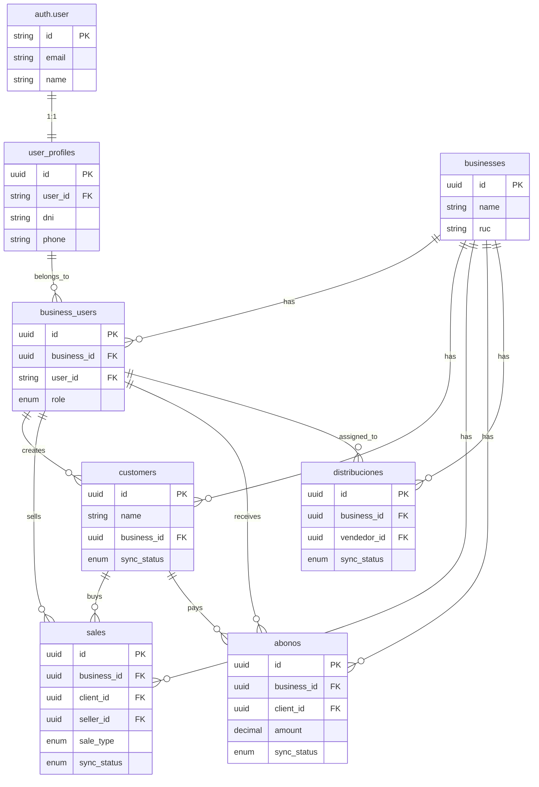

# Avileo Database

> PostgreSQL database schema with Drizzle ORM, designed for offline-first multi-tenancy.

## Table of Contents

1. [Database Architecture](#database-architecture)
2. [Schema Structure](#schema-structure)
3. [Table Reference](#table-reference)
4. [Enums](#enums)
5. [Relations](#relations)
6. [Offline Sync Pattern](#offline-sync-pattern)
7. [Multi-Tenancy Pattern](#multi-tenancy-pattern)
8. [Better Auth Integration](#better-auth-integration)

---

## Database Architecture

### Design Principles

1. **Multi-Tenancy**: Users can belong to multiple businesses
2. **Offline-First**: Tables have `sync_status` for tracking
3. **Better Auth**: Authentication delegated to Better Auth tables
4. **Soft Deletes**: `is_active` boolean for logical deletion
5. **Audit Trail**: `created_at`, `updated_at` on all tables

### Technology Stack

| Component | Technology |
|-----------|------------|
| Database | PostgreSQL 16.x (Neon) |
| ORM | Drizzle ORM |
| Migrations | Drizzle Kit |
| Connection | `sslmode=require` for Neon |

---

## Schema Structure

### File Organization

```
packages/backend/src/db/schema/
├── enums.ts              # PostgreSQL enum definitions
├── user-profiles.ts      # User profile data (extends Better Auth)
├── businesses.ts         # Businesses and business_users
├── customers.ts          # Customers with offline support
├── sales.ts              # Sales and sale_items
├── payments.ts           # Abonos (debt payments)
├── inventory.ts          # Products, stock, distributions
├── config.ts             # System configuration
├── relations.ts          # Drizzle relations
└── index.ts              # Centralized exports
```

### Conventions

| Convention | Implementation |
|------------|----------------|
| **Primary Key** | UUID with `defaultRandom()` |
| **Timestamps** | `created_at`, `updated_at` on all tables |
| **Soft Delete** | `is_active` boolean |
| **Foreign Keys** | `*_id` fields, nullable for optional relations |
| **Multi-tenancy** | `business_id` on operational tables |
| **Sync Tracking** | `sync_status`, `sync_attempts` on offline tables |

---

## Table Reference

### Better Auth Tables (Managed by Better Auth)

Better Auth automatically creates these tables:

| Table | Purpose |
|-------|---------|
| `user` | Users (email, password hash) |
| `session` | Active sessions |
| `account` | Linked accounts (OAuth) |
| `verification` | Verification tokens |

> **Note**: Our schema does NOT define these tables. Access via `user_profiles.user_id`.

---

### user_profiles

**Purpose**: Personal data for each user, independent of business.

| Field | Type | Description |
|-------|------|-------------|
| `id` | uuid PK | Internal ID |
| `user_id` | varchar(255) | FK to `auth.user.id` (Better Auth) |
| `dni` | varchar(20) | Personal ID document |
| `phone` | varchar(50) | Personal phone |
| `birth_date` | date | Date of birth |
| `avatar_url` | varchar(255) | Profile photo URL |
| `is_active` | boolean | Account status |
| `created_at` | timestamp | Creation timestamp |
| `updated_at` | timestamp | Last update timestamp |

**Relation**: 1:1 with `auth.user`

---

### businesses

**Purpose**: Business/company entities. Multi-tenancy root.

| Field | Type | Description |
|-------|------|-------------|
| `id` | uuid PK | Internal ID |
| `name` | varchar(100) | Business name |
| `ruc` | varchar(20) | Tax ID (RUC/DNI) |
| `address` | text | Business address |
| `phone` | varchar(20) | Business phone |
| `email` | varchar(100) | Business email |
| `logo_url` | varchar(255) | Logo URL |
| `modo_operacion` | varchar(50) | Operation mode config |
| `control_kilos` | boolean | Track stock |
| `usar_distribucion` | boolean | Use daily distribution |
| `permitir_venta_sin_stock` | boolean | Allow sales without stock |
| `is_active` | boolean | Business status |
| `created_at` | timestamp | Creation timestamp |
| `updated_at` | timestamp | Last update timestamp |

**Relations**:
- 1:* `business_users` - Users in this business
- 1:* `customers` - Customers of this business
- 1:* `sales` - Sales of this business
- 1:* `abonos` - Payments of this business
- 1:* `distribuciones` - Distributions of this business

---

### business_users

**Purpose**: Many-to-many link between users and businesses with role/sales point.

| Field | Type | Description |
|-------|------|-------------|
| `id` | uuid PK | Internal ID |
| `business_id` | uuid FK | → businesses.id |
| `user_id` | varchar(255) FK | → auth.user.id (Better Auth) |
| `role` | enum | ADMIN_NEGOCIO, VENDEDOR |
| `sales_point` | varchar(100) | Carro A, Casa, etc. |
| `commission_rate` | decimal(5,2) | Commission % in this business |
| `is_active` | boolean | Membership status |
| `joined_at` | timestamp | When joined |
| `updated_at` | timestamp | Last update |

**Key Pattern**: All operational FKs point to `business_users.id` (not `user_profiles.id`)

---

### customers

**Purpose**: Customers with offline sync support.

| Field | Type | Description |
|-------|------|-------------|
| `id` | uuid PK | Internal ID |
| `name` | varchar(255) | Customer name |
| `dni` | varchar(20) | Customer ID |
| `phone` | varchar(50) | Customer phone |
| `address` | text | Customer address |
| `notes` | text | Additional notes |
| `sync_status` | enum | pending, synced, error |
| `sync_attempts` | integer | Sync retry count |
| `business_id` | uuid FK | → businesses.id |
| `created_by` | uuid FK | → business_users.id |
| `created_at` | timestamp | Creation timestamp |
| `updated_at` | timestamp | Last update timestamp |

**Offline**: ✅ Syncs with `sync_status`

---

### sales

**Purpose**: Sales transactions (cash/credit) with offline support.

| Field | Type | Description |
|-------|------|-------------|
| `id` | uuid PK | Internal ID |
| `business_id` | uuid FK | → businesses.id |
| `client_id` | uuid FK | → customers.id (nullable) |
| `seller_id` | uuid FK | → business_users.id |
| `distribucion_id` | uuid FK | → distribuciones.id (nullable) |
| `sale_type` | enum | contado, credito |
| `total_amount` | decimal(12,2) | Total sale amount |
| `amount_paid` | decimal(12,2) | Amount paid |
| `balance_due` | decimal(12,2) | Outstanding balance |
| `tara` | decimal(10,3) | Tare in kg |
| `net_weight` | decimal(10,3) | Net weight in kg |
| `sync_status` | enum | pending, synced, error |
| `sync_attempts` | integer | Sync retry count |
| `sale_date` | timestamp | Sale date |
| `created_at` | timestamp | Creation timestamp |

**Notes**:
- `client_id` can be NULL for sales without customer
- `distribucion_id` can be NULL for systems without inventory control

**Offline**: ✅ Syncs with `sync_status`

---

### sale_items

**Purpose**: Individual line items for each sale.

| Field | Type | Description |
|-------|------|-------------|
| `id` | uuid PK | Internal ID |
| `sale_id` | uuid FK | → sales.id |
| `product_id` | uuid FK | → products.id |
| `product_name` | varchar(255) | Denormalized for offline |
| `quantity` | decimal(10,3) | Quantity/kg |
| `unit_price` | decimal(10,2) | Unit price |
| `subtotal` | decimal(12,2) | Line total |

**Pattern**: `product_name` denormalized so UI works offline without product lookup

---

### abonos

**Purpose**: Debt payments independent of sales.

| Field | Type | Description |
|-------|------|-------------|
| `id` | uuid PK | Internal ID |
| `business_id` | uuid FK | → businesses.id |
| `client_id` | uuid FK | → customers.id |
| `seller_id` | uuid FK | → business_users.id |
| `amount` | decimal(12,2) | Payment amount |
| `payment_method` | enum | efectivo, yape, plin, transferencia |
| `notes` | text | Additional notes |
| `sync_status` | enum | pending, synced, error |
| `sync_attempts` | integer | Sync retry count |
| `created_at` | timestamp | Creation timestamp |

**Use Cases**:
- Customer comes ONLY to pay debt (no purchase)
- Partial debt payment
- Full debt settlement

**Debt Calculation**:
```
Customer Debt = SUM(credit sales) - SUM(abonos)
```

**Offline**: ✅ Syncs with `sync_status`

---

### products

**Purpose**: Product catalog.

| Field | Type | Description |
|-------|------|-------------|
| `id` | uuid PK | Internal ID |
| `name` | varchar(255) | Product name |
| `type` | enum | pollo, huevo, otro |
| `unit` | enum | kg, unidad |
| `base_price` | decimal(10,2) | Suggested base price |
| `is_active` | boolean | Product status |
| `created_at` | timestamp | Creation timestamp |

---

### inventory

**Purpose**: Current stock per product.

| Field | Type | Description |
|-------|------|-------------|
| `id` | uuid PK | Internal ID |
| `product_id` | uuid FK | → products.id |
| `quantity` | decimal(10,3) | Available quantity |
| `updated_at` | timestamp | Last update |

---

### distribuciones

**Purpose**: Daily inventory assignment to vendors.

| Field | Type | Description |
|-------|------|-------------|
| `id` | uuid PK | Internal ID |
| `business_id` | uuid FK | → businesses.id |
| `vendedor_id` | uuid FK | → business_users.id |
| `punto_venta` | varchar(100) | Sales point (Carro A, Casa, etc.) |
| `kilos_asignados` | decimal(10,3) | Kilos assigned |
| `kilos_vendidos` | decimal(10,3) | Kilos sold |
| `monto_recaudado` | decimal(12,2) | Amount collected |
| `fecha` | date | Distribution date |
| `estado` | enum | activo, cerrado, en_ruta |
| `sync_status` | enum | pending, synced, error |
| `sync_attempts` | integer | Sync retry count |
| `created_at` | timestamp | Creation timestamp |

**Offline**: ✅ Syncs with `sync_status`

---

### system_config

**Purpose**: Global system configuration (single row).

| Field | Type | Description |
|-------|------|-------------|
| `id` | uuid PK | Internal ID |
| `modo_operacion` | enum | inventario_propio, sin_inventario, pedidos, mixto |
| `control_kilos` | boolean | Track stock |
| `usar_distribucion` | boolean | Use daily distribution |
| `permitir_venta_sin_stock` | boolean | Allow sales without stock |
| `updated_at` | timestamp | Last update |

---

## Enums

### User Roles

```typescript
enum user_role {
  ADMIN = 'admin',
  VENDEDOR = 'vendedor'
}
```

### Business User Roles

```typescript
enum business_user_role {
  ADMIN_NEGOCIO = 'admin_negocio',
  VENDEDOR = 'vendedor'
}
```

### Sync Status

```typescript
enum sync_status {
  PENDING = 'pending',
  SYNCED = 'synced',
  ERROR = 'error'
}
```

### Sale Type

```typescript
enum sale_type {
  CONTADO = 'contado',    // Cash
  CREDITO = 'credito'     // Credit
}
```

### Payment Method

```typescript
enum payment_method {
  EFECTIVO = 'efectivo',       // Cash
  YAPE = 'yape',               // Yape app
  PLIN = 'plin',               // Plin app
  TRANSFERENCIA = 'transferencia'  // Bank transfer
}
```

### Product Type

```typescript
enum product_type {
  POLLO = 'pollo',    // Chicken
  HUEVO = 'huevo',    // Eggs
  OTRO = 'otro'       // Other
}
```

### Product Unit

```typescript
enum product_unit {
  KG = 'kg',           // Kilograms
  UNIDAD = 'unidad'    // Units/pieces
}
```

### Distribution Status

```typescript
enum distribucion_status {
  ACTIVO = 'activo',       // Active
  CERRADO = 'cerrado',     // Closed
  EN_RUTA = 'en_ruta'      // In route
}
```

### Operation Mode

```typescript
enum modo_operacion {
  INVENTARIO_PROPIO = 'inventario_propio',  // Own inventory
  SIN_INVENTARIO = 'sin_inventario',        // No inventory
  PEDIDOS = 'pedidos',                      // Orders first
  MIXTO = 'mixto'                           // Hybrid
}
```

---

## Relations

### User → Business (Multi-tenancy)

```
auth.user 1:1 user_profiles
auth.user 1:* business_users
business 1:* business_users
```

### Business → Operations

```
businesses 1:* customers (business_id)
businesses 1:* sales (business_id)
businesses 1:* abonos (business_id)
businesses 1:* distribuciones (business_id)
business_users 1:* customers (created_by)
business_users 1:* sales (seller_id)
business_users 1:* abonos (seller_id)
business_users 1:* distribuciones (vendedor_id)
```

### Sales

```
sales 1:* sale_items
customers 1:* sales
distribuciones 1:* sales
```

### Products

```
products 1:1 inventory
products 1:* sale_items
```

### ER Diagram



---

## Offline Sync Pattern

### Tables with Sync Support

| Table | Syncs | Fields |
|-------|-------|--------|
| `customers` | ✅ | `sync_status`, `sync_attempts` |
| `sales` | ✅ | `sync_status`, `sync_attempts` |
| `abonos` | ✅ | `sync_status`, `sync_attempts` |
| `distribuciones` | ✅ | `sync_status`, `sync_attempts` |

### Sync Flow

```
1. CREATE RECORD
   ↓
   sync_status = 'pending'
   sync_attempts = 0

2. ATTEMPT SYNC
   ↓
   IF success → sync_status = 'synced'
   IF error → sync_status = 'error'
              sync_attempts += 1

3. RETRY STRATEGY
   ↓
   Exponential backoff
   Max 3-5 attempts
   Then manual intervention
```

### sync_queue (Local Only)

Local IndexedDB table for pending operations:

| Field | Type | Description |
|-------|------|-------------|
| `id` | UUID | Operation ID |
| `operation_type` | enum | create, update, delete |
| `collection` | varchar | ventas, clientes, etc. |
| `data` | JSON | Operation data |
| `created_at` | timestamp | When created |
| `attempts` | integer | Retry count |
| `last_error` | text | Error message |

---

## Multi-Tenancy Pattern

### Concept

A single user can belong to multiple businesses. Each business sees only its own data.

### Implementation

**All operational tables have `business_id`:**
- `customers.business_id`
- `sales.business_id`
- `abonos.business_id`
- `distribuciones.business_id`

### Query Pattern

```typescript
// Always filter by business_id
const customers = await db
  .select()
  .from(customers)
  .where(eq(customers.business_id, currentBusinessId));
```

### User Context

```typescript
// Get user's role in current business
const businessUser = await db
  .select()
  .from(business_users)
  .where(
    and(
      eq(business_users.user_id, currentUserId),
      eq(business_users.business_id, currentBusinessId)
    )
  );
```

---

## Better Auth Integration

### Table Separation

| Better Auth | Our Schema | Purpose |
|-------------|------------|---------|
| `auth.user` | `user_profiles` | Auth vs Profile data |
| `auth.session` | - | Session management |
| `auth.account` | - | OAuth accounts |

### User Flow

```
1. User registers via Better Auth
   ↓
2. Better Auth creates auth.user record
   ↓
3. Our app creates user_profiles record
   ↓
4. User joins business → business_users record
```

### Foreign Key Pattern

```typescript
// user_profiles references Better Auth
user_id: varchar('user_id', { length: 255 })
  .references(() => auth.user.id)
  .notNull()
```

---

## Database Commands

### Generate Migrations

```bash
cd packages/backend
bun run db:generate
# or
drizzle-kit generate
```

### Run Migrations

```bash
cd packages/backend
bun run db:migrate
# or
drizzle-kit migrate
```

### Push Schema (Dev Only)

```bash
cd packages/backend
bun run db:push
# or
drizzle-kit push
```

### Studio (GUI)

```bash
cd packages/backend
bun run db:studio
# or
drizzle-kit studio
```

---

## Best Practices

### 1. Always Use Transactions for Related Data

```typescript
await db.transaction(async (tx) => {
  const sale = await tx.insert(sales).values({...}).returning();
  await tx.insert(sale_items).values(
    items.map(item => ({...item, sale_id: sale[0].id}))
  );
});
```

### 2. Index Foreign Keys

```typescript
// drizzle-kit generates indexes automatically
// but verify in migrations
```

### 3. Use UUIDs for IDs

```typescript
id: uuid('id').primaryKey().defaultRandom()
```

### 4. Soft Delete Over Hard Delete

```typescript
// Instead of DELETE
await db.update(customers)
  .set({ is_active: false })
  .where(eq(customers.id, id));
```

### 5. Always Include Timestamps

```typescript
created_at: timestamp('created_at').defaultNow(),
updated_at: timestamp('updated_at').defaultNow()
```

---

*For architecture details, see [ARCHITECTURE.md](ARCHITECTURE.md)*
*For business modules, see [MODULES.md](MODULES.md)*
