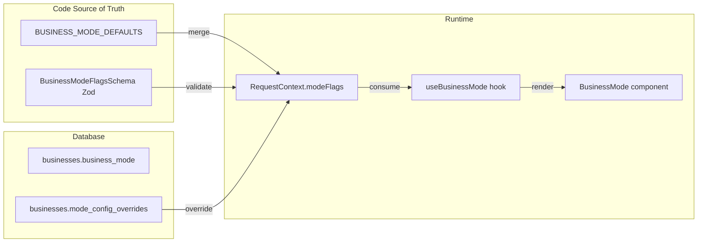

# Business Modes (Multi-Vertical Support)

> Config-driven framework for supporting multiple business verticals in Avileo.
> Each business has a `businessMode` that determines features, UI, and behavior.

## Overview

Avileo supports multiple business verticals through declarative feature flags. Business-specific behavior should be controlled through mode configuration instead of hardcoding vertical checks throughout the codebase.

## Supported Verticals

| Vertical | Slug | Status | Documentation |
|----------|------|--------|---------------|
| Polleria / Venta de Pollo | `polleria` | Active | [`docs/business/polleria.md`](../../../../docs/business/polleria.md) |
| Distribucion de Agua | `agua` | Planned | [`docs/business/distribucion-agua.md`](../../../../docs/business/distribucion-agua.md) |

## Architecture



## Source Of Truth

### Code Defaults And Schema

Schema: `packages/shared/src/business-modes/schema.ts`

Defines all configurable flags with types and defaults:

```typescript
export const BusinessModeFlagsSchema = z.object({
  useTara: z.boolean().default(false),
  useNetWeight: z.boolean().default(false),
  useContainers: z.boolean().default(false),
  useDeposits: z.boolean().default(false),
  useSubscriptions: z.boolean().default(false),
  useFrequency: z.boolean().default(false),
  customCustomerFields: z.array(z.string()).default([]),
  defaultUnit: z.enum(["kg", "unidad"]).default("kg"),
  suggestedProducts: z.array(z.object({ /* ... */ })).default([]),
  closeFields: z.array(z.enum([/* ... */])).default([]),
  saleCalculatorTitle: z.string().default("Nueva Venta"),
  showVisitStatus: z.boolean().default(true),
});
```

Defaults: `packages/shared/src/business-modes/defaults.ts`

```typescript
export const BUSINESS_MODE_DEFAULTS: Record<string, BusinessModeFlags> = {
  polleria: {
    useTara: true,
    useNetWeight: true,
    defaultUnit: "kg",
    closeFields: ["llevado", "vendido", "devuelto"],
    saleCalculatorTitle: "Venta de Pollo",
  },
  agua: {
    useContainers: true,
    useDeposits: true,
    useFrequency: true,
    defaultUnit: "unidad",
    closeFields: ["entregado", "recogido", "danado"],
    saleCalculatorTitle: "Entrega de Agua",
    customCustomerFields: ["frequency", "deliveryDays", "containerCount"],
  },
};
```

### Database Overrides

Table: `businesses`

| Column | Type | Default | Description |
|--------|------|---------|-------------|
| `business_mode` | `varchar(50)` | `polleria` | Vertical slug |
| `mode_config_overrides` | `jsonb` | `{}` | Overrides merged with defaults |

## Backend API

Every request has access to the resolved mode and flags through `RequestContext`:

```typescript
class RequestContext {
  public readonly businessMode: string;
  public readonly modeFlags: BusinessModeFlags;
}
```

Usage in services:

```typescript
if (ctx.modeFlags.useContainers) {
  // Validate container exchange.
}
```

## Frontend API

### Hook: `useBusinessMode()`

```typescript
const { mode, flags, is, hasFlag, isMode } = useBusinessMode();

// mode: "polleria" | "agua"
// flags: merged BusinessModeFlags
// is: { polleria: true, agua: false }
// hasFlag("useTara"): boolean
// isMode("polleria", "agua"): boolean
```

### Component: `BusinessMode`

Conditionally renders children based on mode or flags:

```tsx
<BusinessMode is="agua">
  <ContainerExchange />
</BusinessMode>

<BusinessMode is={["agua", "joyeria"]}>
  <DepositsPanel />
</BusinessMode>

<BusinessMode flag="useTara">
  <TaraInput />
</BusinessMode>

<BusinessMode flag={["useContainers", "useDeposits"]}>
  <ContainerDepositForm />
</BusinessMode>

<BusinessMode isNot="agua">
  <NoAguaFeature />
</BusinessMode>

<BusinessMode flagNot="useTara">
  <NoTaraForm />
</BusinessMode>

<BusinessMode is="polleria" else={<GenericTotal />}>
  <PolleriaTotal />
</BusinessMode>
```

### Component: `BusinessModeField`

Renders fields dynamically based on `customCustomerFields` config:

```tsx
<BusinessModeField field="frequency">
  <FrequencySelect />
</BusinessModeField>

<BusinessModeField field="containerCount">
  <ContainerCountInput />
</BusinessModeField>
```

## Feature Flags Reference

| Flag | Type | Description | Polleria | Agua |
|------|------|-------------|----------|------|
| `useTara` | boolean | Show tara input in calculator | true | false |
| `useNetWeight` | boolean | Show net weight calculations | true | false |
| `useContainers` | boolean | Enable container tracking | false | true |
| `useDeposits` | boolean | Enable deposit/guarantee tracking | false | true |
| `useSubscriptions` | boolean | Enable subscription/recurrence | false | true |
| `useFrequency` | boolean | Enable delivery frequency | false | true |
| `customCustomerFields` | string[] | Extra customer fields | [] | `frequency`, `deliveryDays`, `containerCount` |
| `defaultUnit` | enum | Default product unit | `kg` | `unidad` |
| `suggestedProducts` | object[] | Product templates on business creation | Pollo variants | Bidon variants |
| `closeFields` | enum[] | Distribution close fields | `llevado`, `vendido`, `devuelto` | `entregado`, `recogido`, `danado` |
| `saleCalculatorTitle` | string | Calculator page title | Venta de Pollo | Entrega de Agua |
| `showVisitStatus` | boolean | Show visit status in routes | true | true |

## Add A New Vertical

1. Add defaults in `packages/shared/src/business-modes/defaults.ts`.
2. Use `BusinessMode` or feature flags in frontend components.
3. Use `ctx.modeFlags` in backend services.
4. Document the vertical in `docs/business/{vertical}.md`.
5. Update this reference and the `SKILL.md` summary if the vertical becomes core.

## Backward Compatibility

- Existing businesses without `business_mode` default to `polleria`.
- `mode_config_overrides` defaults to `{}`.
- Existing polleria behavior must remain unchanged unless explicitly migrated.

## Key Files

| File | Purpose |
|------|---------|
| `packages/shared/src/business-modes/schema.ts` | Zod schema for flags |
| `packages/shared/src/business-modes/defaults.ts` | Default configs per mode |
| `packages/shared/src/business-modes/index.ts` | Public exports |
| `packages/backend/src/db/schema/businesses.ts` | DB schema with mode fields |
| `packages/backend/src/context/request-context.ts` | Mode resolution in context |
| `packages/app/app/hooks/use-business-mode.ts` | Frontend hook |
| `packages/app/app/components/business-mode.tsx` | Conditional render component |
| `docs/business/polleria.md` | Polleria vertical docs |
| `docs/business/distribucion-agua.md` | Agua vertical docs |

## See Also

- [SKILL.md](../SKILL.md) - Main skill entry point
- [`docs/business/polleria.md`](../../../../docs/business/polleria.md) - Polleria details
- [`docs/business/distribucion-agua.md`](../../../../docs/business/distribucion-agua.md) - Water distribution details
