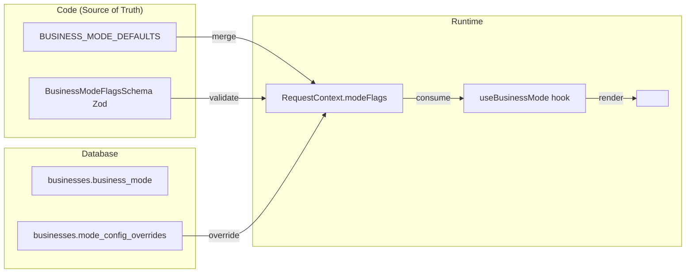

# Business Modes (Multi-Vertical Support)

> Framework config-driven for supporting multiple business verticals in Avileo.
> Each business has a `businessMode` that determines features, UI, and behavior.

## Overview

Avileo is designed to support multiple business verticals (types) through a declarative configuration system. Instead of hardcoding business logic per vertical, the system uses **feature flags** defined per mode, allowing the same codebase to adapt to different business needs.

## Supported Verticals

| Vertical | Slug | Status | Documentation |
|----------|------|--------|---------------|
| **Polleria / Venta de Pollo** | `polleria` | Active | [`docs/business/polleria.md`](../../../../docs/business/polleria.md) |
| **Distribucion de Agua** | `agua` | Planned | [`docs/business/distribucion-agua.md`](../../../../docs/business/distribucion-agua.md) |

## Architecture



## Source of Truth (Dual)

### 1. Code - Defaults & Schema

**Schema (Zod):** `packages/shared/src/business-modes/schema.ts`

Defines all configurable flags with types and defaults:

```typescript
export const BusinessModeFlagsSchema = z.object({
  useTara: z.boolean().default(false),
  useNetWeight: z.boolean().default(false),
  useContainers: z.boolean().default(false),
  useDeposits: z.boolean().default(false),
  useSubscriptions: z.boolean().default(false),
  useFrequency: z.boolean().default(false),
  customCustomerFields: z.array(z.string()).default([]),
  defaultUnit: z.enum(["kg", "unidad"]).default("kg"),
  suggestedProducts: z.array(z.object({...})).default([]),
  closeFields: z.array(z.enum([...])).default([]),
  saleCalculatorTitle: z.string().default("Nueva Venta"),
  showVisitStatus: z.boolean().default(true),
});
```

**Defaults:** `packages/shared/src/business-modes/defaults.ts`

```typescript
export const BUSINESS_MODE_DEFAULTS: Record<string, BusinessModeFlags> = {
  polleria: {
    useTara: true,
    useNetWeight: true,
    defaultUnit: "kg",
    closeFields: ["llevado", "vendido", "devuelto"],
    saleCalculatorTitle: "Venta de Pollo",
    suggestedProducts: [
      { name: "Pollo", variants: [
        { name: "Entero", unitQty: 1 },
        { name: "1/2", unitQty: 0.5 },
        { name: "1/4", unitQty: 0.25 }
      ]}
    ],
    // ... other flags
  },
  agua: {
    useContainers: true,
    useDeposits: true,
    useFrequency: true,
    defaultUnit: "unidad",
    closeFields: ["entregado", "recogido", "danado"],
    saleCalculatorTitle: "Entrega de Agua",
    customCustomerFields: ["frequency", "deliveryDays", "containerCount"],
    suggestedProducts: [
      { name: "Bidon", variants: [
        { name: "20L", unitQty: 1 },
        { name: "10L", unitQty: 1 }
      ]}
    ],
    // ... other flags
  },
};
```

### 2. Database - Per-Business Overrides

**Table:** `businesses`

| Column | Type | Default | Description |
|--------|------|---------|-------------|
| `business_mode` | `varchar(50)` | `'polleria'` | The vertical slug |
| `mode_config_overrides` | `jsonb` | `'{}'` | Overrides merged with defaults |

## Backend API

### RequestContext

Every request has access to the resolved mode and flags:

```typescript
// packages/backend/src/context/request-context.ts
class RequestContext {
  public readonly businessMode: string;      // e.g. "polleria"
  public readonly modeFlags: BusinessModeFlags;  // merged defaults + overrides
}
```

**Usage in services:**
```typescript
if (ctx.modeFlags.useContainers) {
  // Validate container exchange
}
```

### Business Service

The `BusinessService` handles mode-related operations:

```typescript
// packages/backend/src/services/business/business.service.ts
class BusinessService {
  async getBusiness(ctx: RequestContext) {
    // Returns business with mode and flags
  }
}
```

## Frontend API

### Hook: useBusinessMode()

```typescript
// packages/app/app/hooks/use-business-mode.ts
const { mode, flags, is, hasFlag, isMode } = useBusinessMode();

// mode: "polleria" | "agua"
// flags: BusinessModeFlags (merged)
// is: { polleria: true, agua: false }
// hasFlag("useTara"): boolean
// isMode("polleria", "agua"): boolean
```

### Component: <BusinessMode>

Conditionally renders children based on mode or flags:

```tsx
// packages/app/app/components/business-mode.tsx

// By exact mode
<BusinessMode is="agua">
  <ContainerExchange />
</BusinessMode>

// By multiple modes
<BusinessMode is={["agua", "joyeria"]}>
  <DepositsPanel />
</BusinessMode>

// By flag
<BusinessMode flag="useTara">
  <TaraInput />
</BusinessMode>

// By multiple flags (all must match)
<BusinessMode flag={["useContainers", "useDeposits"]}>
  <ContainerDepositForm />
</BusinessMode>

// Negation
<BusinessMode isNot="agua">
  <NoAguaFeature />
</BusinessMode>

// Flag negation
<BusinessMode flagNot="useTara">
  <NoTaraForm />
</BusinessMode>

// With fallback
<BusinessMode is="polleria" else={<GenericTotal />}>
  <PolleriaTotal />
</BusinessMode>
```

### Component: <BusinessModeField>

Renders fields dynamically based on `customCustomerFields` config:

```tsx
// packages/app/app/components/business-mode.tsx

<BusinessModeField field="frequency">
  <FrequencySelect />
</BusinessModeField>

<BusinessModeField field="containerCount">
  <ContainerCountInput />
</BusinessModeField>
```

## Feature Flags Reference

| Flag | Type | Description | Polleria | Agua |
|------|------|-------------|----------|------|
| `useTara` | boolean | Show tara input in calculator | true | false |
| `useNetWeight` | boolean | Show net weight calculations | true | false |
| `useContainers` | boolean | Enable container tracking | false | true |
| `useDeposits` | boolean | Enable deposit/guarantee tracking | false | true |
| `useSubscriptions` | boolean | Enable subscription/recurrence | false | true |
| `useFrequency` | boolean | Enable delivery frequency | false | true |
| `customCustomerFields` | string[] | Extra customer fields | [] | ["frequency", "deliveryDays", "containerCount"] |
| `defaultUnit` | enum | Default product unit | "kg" | "unidad" |
| `suggestedProducts` | object[] | Product templates on business creation | Pollo variants | Bidon variants |
| `closeFields` | enum[] | Distribution close fields | ["llevado", "vendido", "devuelto"] | ["entregado", "recogido", "danado"] |
| `saleCalculatorTitle` | string | Calculator page title | "Venta de Pollo" | "Entrega de Agua" |
| `showVisitStatus` | boolean | Show visit status in routes | true | true |

## How to Add a New Vertical

1. **Add defaults** in `packages/shared/src/business-modes/defaults.ts`:
   ```typescript
   joyeria: {
     useTara: false,
     defaultUnit: "unidad",
     saleCalculatorTitle: "Venta de Joyas",
     // ...
   }
   ```

2. **Use in components** with `<BusinessMode>`:
   ```tsx
   <BusinessMode is="joyeria">
     <JewelrySelector />
   </BusinessMode>
   ```

3. **Document** the vertical in `docs/business/{vertical}.md`

4. **Update** this reference and the SKILL.md

## Backward Compatibility

- Existing businesses without `business_mode` default to `"polleria"`
- The `modeConfigOverrides` JSONB defaults to `{}` (no overrides)
- All existing polleria functionality remains unchanged

## Key Files

| File | Purpose |
|------|---------|
| `packages/shared/src/business-modes/schema.ts` | Zod schema for flags |
| `packages/shared/src/business-modes/defaults.ts` | Default configs per mode |
| `packages/shared/src/business-modes/index.ts` | Public exports |
| `packages/backend/src/db/schema/businesses.ts` | DB schema with mode fields |
| `packages/backend/src/context/request-context.ts` | Mode resolution in context |
| `packages/app/app/hooks/use-business-mode.ts` | Frontend hook |
| `packages/app/app/components/business-mode.tsx` | Conditional render component |
| `docs/business/polleria.md` | Polleria vertical docs |
| `docs/business/distribucion-agua.md` | Agua vertical docs |

## See Also

- [SKILL.md](../SKILL.md) - Main skill documentation
- [`docs/business/polleria.md`](../../../../docs/business/polleria.md) - Polleria vertical details
- [`docs/business/distribucion-agua.md`](../../../../docs/business/distribucion-agua.md) - Water distribution vertical details
