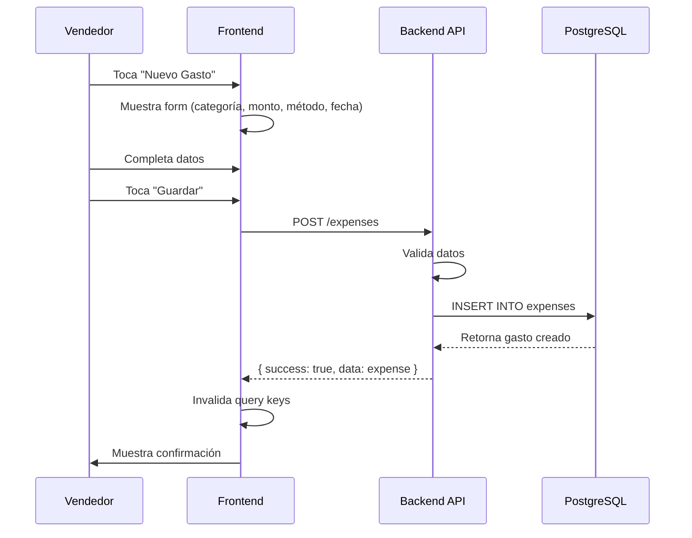

# Plan de Implementación: Módulo de Gastos

## 1. Database Schema (Backend)

### Nuevos archivos:
- `packages/backend/src/db/schema/expense-categories.ts` - Tabla de categorías de gasto
- `packages/backend/src/db/schema/expenses.ts` - Tabla de gastos

### Modificaciones:
- `packages/backend/src/db/schema/enums.ts` - Agregar `expenseCategoryTypeEnum`
- `packages/backend/src/db/schema/index.ts` - Exportar nuevas tablas y tipos

### Schema propuesto:

```typescript
// expense-categories.ts
export const expenseCategories = pgTable("expense_categories", {
  id: uuid("id").primaryKey().defaultRandom(),
  businessId: uuid("business_id").notNull().references(() => businesses.id),
  name: text("name").notNull(),          // Ej: "Transporte", "Suministros"
  description: text("description"),       // Opcional
  icon: text("icon").default("receipt"), // Icono lucide
  color: text("color").default("orange"), // Color para UI
  isActive: boolean("is_active").notNull().default(true),
  createdAt: timestamp("created_at").notNull().defaultNow(),
  updatedAt: timestamp("updated_at").notNull().defaultNow(),
});

// expenses.ts
export const expenses = pgTable("expenses", {
  id: uuid("id").primaryKey().defaultRandom(),
  businessId: uuid("business_id").notNull().references(() => businesses.id),
  distribucionId: uuid("distribucion_id").references(() => distribuciones.id), // Nullable
  categoryId: uuid("category_id").notNull().references(() => expenseCategories.id),
  sellerId: uuid("seller_id").references(() => businessUsers.id),
  
  amount: decimal("amount", { precision: 12, scale: 2 }).notNull(),
  description: text("description"),
  expenseDate: date("expense_date").notNull(),
  
  paymentMethod: paymentMethodEnum("payment_method").notNull().default("efectivo"),
  referenceNumber: varchar("reference_number", { length: 50 }),
  receiptImageId: uuid("receipt_image_id").references(() => files.id),
  
  createdAt: timestamp("created_at").notNull().defaultNow(),
  updatedAt: timestamp("updated_at").notNull().defaultNow(),
});
```

### Categorías predefinidas (seed):
1. Transporte (gasolina, peaje, mantenimiento)
2. Suministros de Venta (bolsas, guantes, film)
3. Conservación (hielo, conservadora)
4. Permisos y Licencias
5. Alimentación (almuerzo, agua)
6. Comunicación (recargas, internet)
7. Otros

## 2. Backend API

### Nuevos archivos:
- `packages/backend/src/services/repository/expense.repository.ts`
- `packages/backend/src/services/repository/expense-category.repository.ts`
- `packages/backend/src/services/business/expense.service.ts`
- `packages/backend/src/services/business/expense-category.service.ts`
- `packages/backend/src/api/expenses.ts`
- `packages/backend/src/api/expense-categories.ts`

### Modificaciones:
- `packages/backend/src/plugins/services.ts` - Registrar repos y servicios
- `packages/backend/src/app.ts` - Montar rutas

### Endpoints:

**Gastos:**
- `GET /expenses` - Listar gastos (con filtros: fecha, categoría, distribución)
- `GET /expenses/:id` - Obtener gasto por ID
- `POST /expenses` - Crear gasto
- `PUT /expenses/:id` - Actualizar gasto
- `DELETE /expenses/:id` - Eliminar gasto
- `POST /expenses/:id/receipt` - Subir comprobante (foto)
- `GET /expenses/by-distribucion/:distribucionId` - Gastos de una distribución

**Categorías:**
- `GET /expense-categories` - Listar categorías
- `POST /expense-categories` - Crear categoría
- `PUT /expense-categories/:id` - Actualizar categoría
- `DELETE /expense-categories/:id` - Eliminar categoría

## 3. Frontend Components

### Nuevos archivos:

**Components:**
- `packages/app/app/components/expenses/expense-capture.tsx` - Componente dual mode (drawer/inline)
- `packages/app/app/components/expenses/expense-category-selector.tsx` - Selector de categoría
- `packages/app/app/components/expenses/expense-summary.tsx` - Resumen del gasto
- `packages/app/app/components/expenses/receipt-capture.tsx` - Captura de comprobante
- `packages/app/app/components/expenses/index.ts`

**Hooks:**
- `packages/app/app/hooks/use-expenses.ts` - CRUD de gastos
- `packages/app/app/hooks/use-expense-capture.ts` - Hooks de captura
- `packages/app/app/hooks/use-expense-categories.ts` - CRUD de categorías

**Routes:**
- `packages/app/app/routes/_protected.gastos._index.tsx` - Lista de gastos
- `packages/app/app/routes/_protected.gastos.nuevo.tsx` - Nuevo gasto
- `packages/app/app/routes/_protected.gastos.$id._index.tsx` - Detalle/editar gasto

### Modificaciones:
- `packages/app/app/lib/query-keys.ts` - Agregar query keys
- `packages/app/app/routes.ts` - Registrar rutas
- `packages/app/app/routes/_protected.dashboard.tsx` - Widget de gastos del día
- `packages/app/app/routes/_protected.mi-distribucion.tsx` - Botón "Registrar gasto"

## 4. Integración con Distribución

### En "Mi Distribución":
- Botón "Registrar Gasto" que abre form inline
- Los gastos se vinculan a la distribución activa (`distribucionId`)
- En el cierre de distribución: mostrar total de gastos

### En Dashboard:
- Widget "Gastos del Día" junto a "Ventas del Día"
- Cálculo: `Utilidad Neta = Ventas - Compras - Gastos`

## 5. Reportes y Estadísticas

### Nuevos endpoints:
- `GET /reports/expenses` - Reporte de gastos por período
- `GET /reports/expense-summary` - Resumen para dashboard

### Métricas:
- Total de gastos por día/semana/mes
- Gastos por categoría (gráfico)
- Comparativa Ingresos vs Egresos
- Margen neto del negocio

## 6. Flujo de Datos



## 7. Archivos a Modificar (Resumen)

| Archivo | Acción |
|---------|--------|
| `backend/src/db/schema/enums.ts` | Agregar expenseCategoryTypeEnum |
| `backend/src/db/schema/index.ts` | Exportar nuevas tablas |
| `backend/src/plugins/services.ts` | Registrar expense repos/services |
| `backend/src/app.ts` | Montar expense routes |
| `app/app/lib/query-keys.ts` | Agregar expense query keys |
| `app/app/routes.ts` | Registrar rutas de gastos |
| `app/app/routes/_protected.dashboard.tsx` | Widget de gastos |
| `app/app/routes/_protected.mi-distribucion.tsx` | Botón registrar gasto |

## 8. Categorías de Gasto Sugeridas

| Categoría | Icono | Ejemplos |
|-----------|-------|----------|
| Transporte | `truck` | Gasolina, peaje, mantenimiento |
| Suministros | `package` | Bolsas, guantes, film |
| Conservación | `snowflake` | Hielo, conservadora |
| Permisos | `file-check` | Municipal, salud |
| Alimentación | `utensils` | Almuerzo, agua |
| Comunicación | `phone` | Recargas, internet |
| Otros | `more-horizontal` | Cualquier otro |

## 9. Consideraciones

- **Multi-tenancy**: Todos los queries filtran por `businessId`
- **Permisos**: Reutilizar permisos existentes (`sales.write` para crear gastos)
- **Offline**: No aplica, la app es online-first
- **Mobile-first**: Diseño para 320px-428px
- **Consistencia**: Reusar `PaymentMethodSelector`, `ProofCapture` patterns
- **Fechas**: Usar timezone local (Peru UTC-5)

## 10. Testing

- Backend: Tests de repository y service
- Frontend: Tests de hooks y componentes
- E2E: Flujo completo de crear/editar/eliminar gasto
