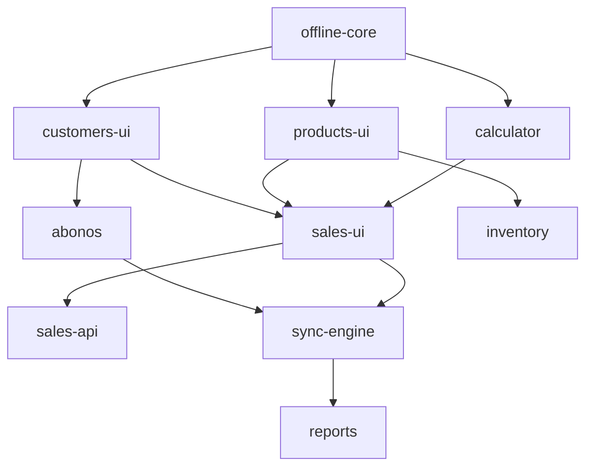

# Análisis de Funcionalidades - Avileo (PollosPro)

> Documento de análisis del estado actual y planificación de desarrollo modular
> Fecha: 12 de Febrero, 2026

---

## Resumen Ejecutivo

| Área | Estado | Progreso |
|------|--------|----------|
| **Fase 1: Autenticación** | ✅ Completada | 100% |
| **Database Schema** | ✅ Completo | 100% (16 tablas) |
| **Backend API** | ⚠️ Parcial | ~45% (6/15 módulos) |
| **Frontend Routes** | ⚠️ Parcial | 10 rutas implementadas |
| **Offline-First** | ❌ No iniciado | 0% |

---

## Estado Detallado por Módulo

### ✅ Módulos Completos

#### 1. Sistema de Autenticación
**Estado:** ✅ COMPLETADO (11 Feb 2026)

**Implementado:**
- Backend: Better Auth con Drizzle ORM + PostgreSQL
- API endpoints: `/auth/*` (login, register, logout, session)
- Middleware `requireAuth` para rutas protegidas
- JWT sessions (7 días expiración)
- Frontend: Login, registro, layout protegido
- Perfil de usuario (DNI, teléfono, avatar)
- Gestión de negocios (crear, editar, logo)
- Sistema de invitaciones (admin invita vendedores)
- RBAC con matriz de permisos (17 permisos definidos)

**Archivos clave:**
- `packages/backend/src/lib/auth.ts`
- `packages/backend/src/middleware/auth.ts`
- `packages/backend/src/context/request-context.ts`
- `packages/app/app/hooks/use-auth.ts`

---

### ⚠️ Módulos Parciales

#### 2. Backend APIs Implementadas

| Módulo | API | Service | Repository | Estado |
|--------|-----|---------|------------|--------|
| **Auth** | ✅ | N/A | N/A | ✅ Completo |
| **User Profiles** | ✅ | N/A | N/A | ✅ Completo |
| **Businesses** | ✅ | ✅ | ✅ | ✅ Completo |
| **Staff Invitations** | ✅ | Inline | Inline | ✅ Completo |
| **Customers** | ✅ | ✅ | ✅ | ✅ Completo |
| **Products** | ✅ | ✅ | ✅ | ✅ Completo |
| **Payments (Abonos)** | ✅ | ✅ | ✅ | ✅ Completo |
| **Sales** | ❌ | ❌ | ❌ | ❌ Faltante |
| **Inventory** | ❌ | ❌ | ❌ | ❌ Faltante |
| **Distribution** | ❌ | ❌ | ❌ | ❌ Faltante |
| **Sync Engine** | ❌ | ❌ | ❌ | ❌ Faltante |

---

### ❌ Módulos Faltantes

#### 3. Frontend - Rutas No Implementadas

| Ruta | Propósito | Prioridad |
|------|-----------|-----------|
| `/sales` | Registro de ventas | 🔴 Crítica |
| `/sales/new` | Nueva venta | 🔴 Crítica |
| `/customers` | Gestión de clientes | 🟡 Alta |
| `/calculator` | Calculadora de precios | 🟡 Alta |
| `/abonos` | Registro de pagos | 🟡 Alta |
| `/reports` | Reportes de ventas | 🟢 Media |
| `/inventory` | Control de inventario | 🟢 Media |
| `/distribution` | Distribución a vendedores | 🟢 Media |
| `/sync` | Estado de sincronización | 🔴 Crítica |

---

## Estrategia de Branching

Cada funcionalidad puede desarrollarse en una rama independiente con dependencias claramente definidas:

```
main (estable)
├── feature/offline-core          # Base para todo - SIN dependencias
├── feature/customers-ui          # Depende de: offline-core
├── feature/products-ui           # Depende de: offline-core  
├── feature/calculator            # Depende de: offline-core
├── feature/sales-api             # Depende de: products, customers
├── feature/sales-ui              # Depende de: sales-api, calculator
├── feature/abonos                # Depende de: customers
├── feature/sync-engine           # Depende de: sales, abonos
├── feature/reports               # Depende de: sync-engine
├── feature/inventory             # Depende de: products
└── feature/distribution          # Depende de: inventory
```

---

## Plan de Implementación

### 🔴 CRÍTICO - Bloquea el MVP

#### Rama 1: `feature/offline-core`
**Duración:** 5-7 días  
**Dependencias:** Ninguna (base para todo)  
**Bloquea:** Todas las demás ramas

**Tareas:**
- Instalar y configurar TanStack DB
- Configurar IndexedDB con idb-keyval
- Crear colecciones: customers, sales, products, config
- Implementar persistencia automática
- Crear hook `useConnection` (online/offline)
- Crear `DBContext` provider
- Configurar Service Worker básico

**Archivos a crear:**
```
packages/app/app/lib/db.ts
packages/app/app/hooks/use-connection.ts
packages/app/app/context/db-context.tsx
packages/app/app/offline/collections.ts
```

---

#### Rama 2: `feature/sales-api`
**Duración:** 3-4 días  
**Dependencias:** Products, Customers (DB ya existe)  
**Bloquea:** Sales UI, Reports

**Tareas:**
- Crear `sale.repository.ts` (CRUD + items)
- Crear `sale.service.ts` (lógica de negocio)
- Crear `sales.ts` API routes
- Endpoints: GET/POST/PUT/DELETE /sales
- Manejar items de venta (crear con venta)
- Validar stock si aplica
- Calcular totales automáticamente

**Archivos a crear:**
```
packages/backend/src/services/repository/sale.repository.ts
packages/backend/src/services/business/sale.service.ts
packages/backend/src/api/sales.ts
```

---

### 🟡 ALTA PRIORIDAD

#### Rama 3: `feature/customers-ui`
**Duración:** 3-4 días  
**Dependencias:** offline-core  
**Bloquea:** Abonos, Sales

**Tareas:**
- Crear hook `useCustomers` (TanStack DB)
- Página `/customers` - Listado con búsqueda
- Página `/customers/new` - Crear cliente
- Página `/customers/:id` - Ver/editar cliente
- Componente `CustomerCard`
- Cálculo de deuda (ventas crédito - abonos)
- Integrar con sync status

---

#### Rama 4: `feature/calculator`
**Duración:** 2-3 días  
**Dependencias:** offline-core  
**Bloquea:** Sales UI

**Tareas:**
- Crear hook `useCalculator`
- Página `/calculator`
- Componente visual tipo app móvil
- 3 casos de cálculo (enter 2, calcula 3ro)
- Resta de tara configurable
- Historial de cálculos recientes
- Botón "Usar en venta" (integración con sales)

---

#### Rama 5: `feature/products-ui`
**Duración:** 2-3 días  
**Dependencias:** offline-core  
**Bloquea:** Inventory

**Tareas:**
- Crear hook `useProducts`
- Página `/products` - Catálogo de productos
- CRUD de productos (admin only)
- Tipos: pollo, huevo, otro
- Unidades: kg, unidad
- Precio base configurable

---

#### Rama 6: `feature/sales-ui`
**Duración:** 4-5 días  
**Dependencias:** sales-api, calculator, customers-ui  
**Bloquea:** Reports, Sync

**Tareas:**
- Página `/sales` - Historial de ventas
- Página `/sales/new` - Nueva venta (wizard)
- Seleccionar cliente (opcional)
- Agregar productos con cantidad
- Seleccionar tipo: contado/crédito
- Mostrar totales y cambio
- Integrar calculadora
- Guardar offline (TanStack DB)
- Estados de sync

---

#### Rama 7: `feature/abonos`
**Duración:** 2-3 días  
**Dependencias:** customers-ui

**Tareas:**
- Crear hook `usePayments`
- Página `/abonos` - Listado
- Modal `RegistrarAbono`
- Seleccionar cliente
- Monto y método de pago
- Efectivo, Yape, Plin, Transferencia
- Actualizar deuda del cliente
- Guardar offline

---

### 🟢 MEDIA PRIORIDAD

#### Rama 8: `feature/inventory`
**Duración:** 3-4 días  
**Dependencias:** products-ui

**Tareas:**
- API endpoints `/inventory`
- Hook `useInventory`
- Página `/inventory` - Stock actual
- Página `/distribution` - Asignación diaria (admin)
- Vendedor ve su asignación del día
- Control de kilos vendidos vs asignados
- Estados: activo, en_ruta, cerrado

---

#### Rama 9: `feature/sync-engine`
**Duración:** 4-6 días  
**Dependencias:** sales, abonos

**Tareas:**
- Crear `SyncQueue` con IndexedDB
- Hook `useSync` con estado global
- Endpoints `/sync/push` y `/sync/pull`
- Detectar conexión automáticamente
- Sincronizar cada 30s cuando hay internet
- Manejar conflictos (estrategia "last wins")
- UI de estado: 🟢🟡🔴
- Retry con exponential backoff

---

#### Rama 10: `feature/reports`
**Duración:** 3-4 días  
**Dependencias:** sync-engine

**Tareas:**
- API endpoints `/reports`
- Hook `useReports`
- Página `/reports` - Dashboard admin
- Stats cards: ventas hoy, crédito vs contado
- Gráfico de ventas por hora
- Top vendedores
- Exportar a CSV/Excel
- Filtros por fecha

---

## Uso de TS-Pattern

Para mejorar el manejo de condicionales complejos, se utilizará **ts-pattern** en lugar de if/else anidados.

### Instalación
```bash
bun add ts-pattern
```

### Casos de Uso

#### 1. Validación de Permisos
```typescript
import { match, P } from 'ts-pattern';

const canPerformAction = (ctx: RequestContext, action: string) =>
  match([ctx.role, action])
    .with(['ADMIN_NEGOCIO', P._], () => true)
    .with(['VENDEDOR', 'sales.create'], () => true)
    .with(['VENDEDOR', 'sales.read'], () => true)
    .with(['VENDEDOR', P._], () => false)
    .exhaustive();
```

#### 2. Manejo de Estados de Sync
```typescript
import { match } from 'ts-pattern';

const getSyncStatusMessage = (status: SyncStatus) =>
  match(status)
    .with('pending', () => '⏳ Pendiente de sincronización')
    .with('synced', () => '✅ Sincronizado')
    .with('error', () => '❌ Error de sincronización')
    .exhaustive();
```

#### 3. Cálculo de Stock según Configuración
```typescript
import { match } from 'ts-pattern';

const calculateAvailableStock = (
  config: BusinessConfig,
  distribucion: Distribucion
) =>
  match(config)
    .with(
      { usarDistribucion: true, controlKilos: true },
      () => parseFloat(distribucion.kilosAsignados) - parseFloat(distribucion.kilosVendidos)
    )
    .with(
      { usarDistribucion: true, controlKilos: false },
      () => Infinity
    )
    .with(
      { usarDistribucion: false },
      () => null
    )
    .exhaustive();
```

#### 4. Flujo de Venta según Modo de Operación
```typescript
import { match } from 'ts-pattern';

const processSale = (saleData: SaleData, config: BusinessConfig) =>
  match(config.modoOperacion)
    .with('inventario_propio', () => processSaleWithInventory(saleData))
    .with('sin_inventario', () => processSaleWithoutInventory(saleData))
    .with('pedidos', () => processPreorder(saleData))
    .with('mixto', () => processMixedMode(saleData))
    .exhaustive();
```

---

## Configuración de Inventario

El sistema soporta configuración flexible de inventario mediante flags en la tabla `businesses`:

### Flags de Configuración

| Flag | Tipo | Descripción | Default |
|------|------|-------------|---------|
| `modoOperacion` | varchar | Modo: inventario_propio, sin_inventario, pedidos, mixto | "inventario_propio" |
| `controlKilos` | boolean | ¿Validar stock disponible? | true |
| `usarDistribucion` | boolean | ¿Usar distribución del día? | true |
| `permitirVentaSinStock` | boolean | ¿Permitir vender sin asignación? | false |

### Comportamientos según Configuración

#### Modo 1: Inventario Propio (Control Estricto)
```typescript
{
  modoOperacion: 'inventario_propio',
  controlKilos: true,
  usarDistribucion: true,
  permitirVentaSinStock: false
}
```
- Admin asigna kilos a vendedores
- Vendedor solo puede vender hasta su límite
- Stock se valida en cada venta

#### Modo 2: Inventario Propio (Permisivo)
```typescript
{
  modoOperacion: 'inventario_propio',
  controlKilos: true,
  usarDistribucion: true,
  permitirVentaSinStock: true
}
```
- Admin asigna kilos a vendedores
- Vendedor puede vender más allá de la asignación
- Sistema muestra advertencia pero permite

#### Modo 3: Sin Inventario (Libre)
```typescript
{
  modoOperacion: 'sin_inventario',
  controlKilos: false,
  usarDistribucion: false,
  permitirVentaSinStock: true
}
```
- Solo registro de ventas
- Sin control de stock
- Sin distribuciones

#### Modo 4: Pedidos Primero
```typescript
{
  modoOperacion: 'pedidos',
  controlKilos: true,
  usarDistribucion: false,
  permitirVentaSinStock: false
}
```
- Cliente ordena primero
- Admin compra stock para cumplir
- Venta se procesa cuando hay stock

---

## Dependencias Entre Módulos



---

## MVP Listo Después De

- ✅ Phase 1: Auth (ya está)
- ✅ Rama 1: Offline Core
- ✅ Rama 2: Sales API
- ✅ Rama 3: Customers UI
- ✅ Rama 4: Calculator
- ✅ Rama 6: Sales UI
- ✅ Rama 7: Abonos

**Total estimado:** 3-4 semanas para MVP completo

---

## Notas de Implementación

### Patrones de Código Backend

**Repository Pattern:**
```typescript
// ctx SIEMPRE es el primer parámetro
async findMany(ctx: RequestContext, filters?: {...}): Promise<Customer[]>

// Multi-tenancy filtering MANDATORY
.where(and(
  eq(customers.id, id),
  eq(customers.businessId, ctx.businessId)
))
```

**Service Pattern:**
```typescript
async createCustomer(ctx: RequestContext, data) {
  // 1. Permission check FIRST
  if (!ctx.hasPermission("customers.create")) {
    throw new ForbiddenError("...");
  }
  // 2. Validation
  // 3. Business logic
  // 4. Repository create
}
```

### Decisiones Arquitectónicas

1. **Actualización de `kilosVendidos`:** Real-time (cada venta actualiza la distribución)
2. **Unicidad de distribución:** (vendedorId, fecha) debe ser único
3. **Stock validation timing:** At sale creation (strict mode)
4. **Conflict resolution:** "Last wins" para sync offline

---

## Documentación Relacionada

- [Plan de Desarrollo](../development/readme.md)
- [Arquitectura Técnica](./readme.md)
- [Database Schema](./database.md)
- [Offline Strategy](./offline-plan.md)
- [UI/UX Screens](../screens/readme.md)

---

*Documento generado automáticamente por análisis de código*
