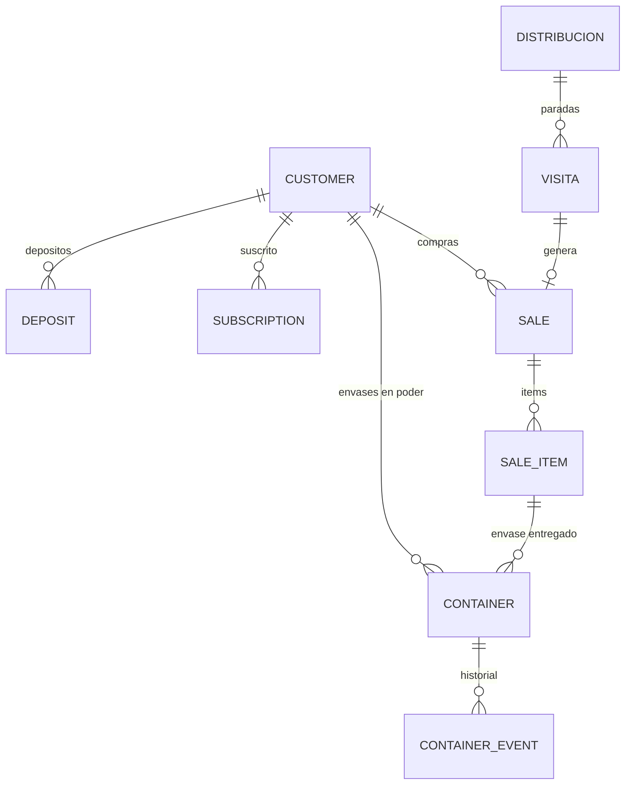

# Distribucion de Agua

> Vertical por implementar en Avileo. Reparto de bidones y botellas de agua a domicilio con clientes suscritos y envases retornables.

---

## Resumen

Los negocios de distribucion de agua embotellada operan con **rutas fijas** y **clientes recurrentes**. A diferencia de la polleria, el agua no es perecedera en el mismo sentido, pero tiene una logistica compleja por el manejo de **envases retornables** (bidones de 20L, botellas de 10L, etc.) y **depositos de garantia**.

**Caracteristicas clave:**
- Clientes suscritos a frecuencias de entrega (diaria, 2x semana, semanal)
- Envases retornables con numero de serie o codigo
- Deposito por envase (garantia financiera)
- Rutas fijas por dias de semana
- Pago contra entrega (efectivo, Yape, Plin)
- Control de envases en poder del cliente
- Reemplazo de envases danados o viejos

---

## Flujo de Trabajo

### 1. Suscripcion del Cliente

```
Nuevo cliente solicita servicio
  → Registra datos (nombre, direccion, telefono, DNI)
  → Selecciona frecuencia (diario, lunes/miercoles/viernes, semanal)
  → Entrega deposito por envase(s)
  → Sistema asigna numero de serie a cada envase entregado
  → Cliente queda activo en ruta
```

**Pantallas propuestas:** `/clientes/nuevo` con modalidad suscripcion

### 2. Preparacion de Rutas (Administrador)

```
Admin planifica rutas del dia
  → Filtra clientes por dia de entrega (ej: todos los "lunes")
  → Asigna vendedor/repartidor y vehiculo
  → Sistema calcula: cuantos envases llenos llevar
  → Genera lista de entregas con saldo de cada cliente
```

**Pantallas propuestas:** `/distribuciones/nueva` adaptada a rutas de agua

### 3. Reparto en Ruta (Repartidor)

```
Repartidor inicia su ruta
  → Ve lista ordenada de clientes a visitar
  → En cada parada:
      - Entrega envase(s) lleno(s)
      - Recoge envase(s) vacio(s)
      - Verifica estado del envase (danado = reemplazar)
      - Cobra: precio del agua + saldo pendiente (si aplica)
      - Registra metodo de pago
      - Actualiza stock de envases en camion
  → Cliente puede:
      - Pedir envases adicionales (fuera de frecuencia)
      - Solicitar baja del servicio (devolver envases + deposito)
```

**Pantallas propuestas:** `/mi-distribucion`, `/visitas` adaptadas

### 4. Cierre de Jornada (Repartidor)

```
Repartidor cierra ruta
  → Reporta: envases entregados / recogidos / danados
  → Recaudacion del dia (efectivo/Yape/Plin)
  → Envases vacios retornados a planta
  → Gastos de ruta (gasolina, etc.)
```

### 5. Gestion de Envases y Depositos (Admin)

```
Admin controla envases
  → Stock de envases en planta (nuevos, usados, danados)
  → Envases en poder de clientes (por cliente y total)
  → Depositos retenidos (liability del negocio)
  → Devolucion de depositos al cancelar servicio
```

---

## Entidades del Sistema

### Tablas que se reutilizan de Avileo

| Tabla | Reutilizacion | Ajustes necesarios |
|-------|---------------|-------------------|
| `businesses` | Config del negocio | Agregar `businessType` o flag de vertical |
| `business_users` | Repartidores y admins | Sin cambios |
| `customers` | Clientes suscritos | Agregar: frecuencia, envases asignados, deposito |
| `distribuciones` | Ruta diaria | Sin cambios (concepto aplica) |
| `distribucion_items` | Productos de la ruta | Cambiar unidad a "botella", "bidon" |
| `visitas` | Paradas de la ruta | Sin cambios |
| `sales` | Ventas de agua | Sin cambios (sin tara/netWeight) |
| `sale_items` | Lineas de venta | Cantidad en unidades (no kg) |
| `abonos` | Pagos recibidos | Sin cambios |
| `puntos_venta` | Modalidades | "ruta", "camion", "moto" |

### Tablas nuevas requeridas

| Tabla | Proposito | Campos clave |
|-------|-----------|--------------|
| `containers` / `envases` | Tracking de envases retornables | `serialNumber`, `capacity`, `status`, `customerId` |
| `deposits` / `depositos` | Libro de depositos por envase | `customerId`, `amount`, `containersCount`, `type` |
| `subscriptions` / `suscripciones` | Frecuencia de entrega | `customerId`, `frequency`, `deliveryDays[]` |

### Relaciones propuestas



---

## Peculiaridades del Negocio

### 1. Envases Retornables con Serie

Cada envase (bidon de 20L, botella de 10L) tiene un numero de serie o codigo de barras. El sistema debe rastrear:
- Donde esta cada envase (planta, cliente, camion)
- Cuanto tiempo lleva con el cliente
- Estado (nuevo, usado, danado, perdido)

**Gap en Avileo:** No existe tracking de activos individuales. `variant_inventory` maneja cantidades, no series.

### 2. Deposito de Garantia

El cliente paga un deposito por cada envase que recibe (ej: S/ 30 por bidon). Este dinero:
- No es ingreso del negocio (es un pasivo)
- Se devuelve cuando el cliente cancela y devuelve el envase
- Debe estar separado de las ventas/abonos

**Gap en Avileo:** No existe libro de depositos. `abonos` es para pagos de deuda, no garantias.

### 3. Suscripciones y Frecuencias

Los clientes no compran "una vez". Se suscriben a una frecuencia:
- Diario (7 dias a la semana)
- Lunes-Miercoles-Viernes
- Martes-Jueves-Sabado
- Semanal (1 dia especifico)
- Quincenal

El sistema debe auto-generar las visitas/entregas segun la frecuencia.

**Gap en Avileo:** No existe motor de suscripciones ni recurrencia.

### 4. Intercambio en la Entrega

La logistica tipica es:
1. Repartidor lleva envase lleno al cliente
2. Recoge el envase vacio del cliente
3. Si el envase vacio esta danado, cobra penalidad o reemplaza
4. Cliente puede pedir envases adicionales (evento fuera de frecuencia)

Esto no es una venta simple: es un **intercambio** con cobro por el contenido.

**Gap en Avileo:** El modelo de venta es unidireccional (entrega producto, cobra). No maneja retorno de envases.

### 5. Control de Envases por Cliente

Es comun que los clientes acumulen envases (tener 3 bidones porque "se les olvido devolver el vacio"). El sistema debe:
- Mostrar cuantos envases tiene cada cliente
- Alertar si un cliente tiene demasiados envases sin rotacion
- Cobrar depositos adicionales si el cliente quiere mas envases

**Gap en Avileo:** No hay contador de envases en poder del cliente.

### 6. Pago Contra Entrega

A diferencia de la polleria donde mucho es credito, en agua el pago es inmediato:
- Efectivo
- Yape / Plin
- Transferencia

El repartidor debe llevar cambio y verificar pagos digitales en el momento.

**En Avileo:** Los metodos de pago ya estan implementados (`paymentMethodEnum`).

### 7. Baja de Servicio y Devolucion

Cuando un cliente cancela:
1. Devuelve todos los envases
2. Se inspecciona estado de cada envase
3. Se devuelve deposito por envases en buen estado
4. Se descuenta deposito por envases danados/perdidos
5. Cliente queda inactivo

**Gap en Avileo:** No existe flujo de baja ni devolucion de depositos.

### 8. Rutas Fijas por Dia

Los repartidores tienen rutas estables:
- Lunes: Ruta A (Barrio Centro)
- Martes: Ruta B (Barrio Norte)
- Miercoles: Ruta A de nuevo

Esto permite optimizacion y conocimiento del terreno.

**En Avileo:** Las `distribuciones` son diarias. Se puede adaptar creando distribuciones recurrentes.

---

## Puntos de Venta / Modalidades

| Tipo | Descripcion | Uso tipico |
|------|-------------|------------|
| **Camion** | Vehiculo con carga de bidones | Reparto masivo a hogares y negocios |
| **Moto** | Moto con cajon o canasta | Reparto rapido en zonas congestionadas |
| **Ruta fija** | Recorrido peatonal con carretilla | Mercados, calles peatonales |
| **Local** | Punto fijo de venta | Clientes pasan a recoger |

---

## Cobertura en Avileo

| Feature | Estado | Notas |
|---------|--------|-------|
| Distribucion diaria | ⚠️ Reutilizable | `distribuciones` aplica pero sin recurrencia |
| Clientes y rutas | ⚠️ Parcial | `customers` + `visitas` funcionan, falta frecuencia |
| Ventas contado | ✅ Implementado | `sales` con `saleType = 'contado'` |
| Cobranza/abonos | ✅ Implementado | Tabla `abonos` |
| Offline-first | ✅ Implementado | PGlite + sync |
| Tracking de envases | ❌ No existe | Necesita tabla `containers` |
| Depositos de garantia | ❌ No existe | Necesita tabla `deposits` |
| Suscripciones | ❌ No existe | Necesita motor de recurrencia |
| Intercambio envase lleno/vacio | ❌ No existe | Flujo bidireccional no soportado |
| Control de envases por cliente | ❌ No existe | Contador en `customers` |
| Devolucion de depositos | ❌ No existe | Flujo de baja no soportado |

**Cobertura estimada: 40%**

---

## Brechas a Cerrar para Soportar Agua

### Alta Prioridad
1. **Tabla `containers`** - Tracking de envases por numero de serie
2. **Tabla `deposits`** - Libro de depositos de garantia
3. **Campo `subscription` en customers** - Frecuencia de entrega
4. **Flujo de intercambio** - Entrega lleno + recogida vacio en una sola transaccion

### Media Prioridad
5. **Motor de recurrencia** - Auto-generar distribuciones/visitas segun frecuencia
6. **Contador de envases** - En `customers` o tabla auxiliar
7. **Flujo de baja** - Cancelacion de servicio + devolucion de depositos

### Baja Prioridad
8. **Optimizacion de rutas** - Ordenar paradas por eficiencia
9. **Alertas de envases** - Clientes con muchos envases sin rotacion
10. **Re-certificacion de envases** - Tracking de envases viejos para reemplazo

---

## Hallazgos Pendientes

> Espacio para registrar descubrimientos durante investigacion de campo.

- [ ] Validar capacidades tipicas de envases (20L, 10L, 5L, 1.5L)
- [ ] Confirmar montos tipicos de deposito por envase
- [ ] Investigar si existen "envases de propiedad del cliente" (sin deposito)
- [ ] Validar frecuencias de entrega mas comunes
- [ ] Confirmar si los repartidores llevan cambio o si los clientes pagan exacto
- [ ] Investigar integracion con Yape/Plin para cobro en ruta

---

*Documento de vertical - Distribucion de Agua. Ultima actualizacion: 2026-05-05*
