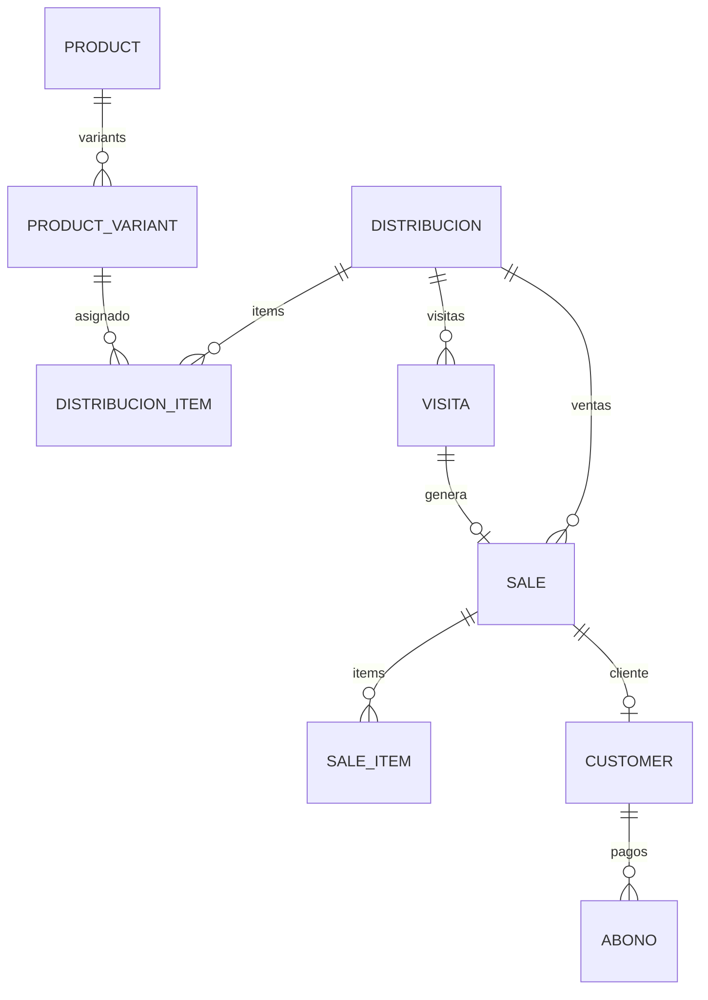

# Polleria / Venta de Pollo

> Vertical principal de Avileo. Venta de pollo a domicilio por vendedores ambulantes con control de inventario diario.

---

## Resumen

Los negocios de polleria en Peru operan con vendedores que recorren calles, mercados y barrios vendiendo pollo fresco directo al consumidor. El modelo es **distribucion diaria**: el administrador asigna una cantidad de kilos a cada vendedor por la manana, el vendedor recorre su ruta vendiendo, y al final del dia cierra su jornada reportando lo vendido y lo devuelto.

**Caracteristicas clave:**
- Producto perecedero (vence en horas, no dias)
- Venta por peso con balanza portatil
- Alta rotacion de clientes (muchas ventas sin cliente registrado)
- Prevalencia alta de ventas a credito
- Precio varia diariamente segun el mercado mayorista

---

## Flujo de Trabajo

### 1. Preparacion (Administrador)

```
Admin crea Distribucion
  → Selecciona vendedor
  → Selecciona punto de venta (carro, local, mercado, ruta)
  → Asigna productos/variantes con cantidades (kg)
  → Confirma asignacion
```

**Pantallas:** `/distribuciones/nueva`

### 2. Venta en Ruta (Vendedor)

```
Vendedor inicia su dia
  → Ve "Mi Distribucion" con kilos asignados
  → Recorre clientes (Visitas)
  → En cada parada:
      - Pesa el pollo (kilos brutos - tara = netos)
      - Calcula precio (kg netos x precio/kg)
      - Registra venta (contado o credito)
      - Cliente puede pagar ahora o quedar debiendo
  → Registra gastos del dia (gasolina, comida, etc.)
```

**Pantallas:** `/mi-distribucion`, `/visitas`, calculadora de venta

### 3. Cierre de Jornada (Vendedor/Admin)

```
Vendedor cierra distribucion
  → Reporta: llevado / vendido / devuelto
  → Sistema calcula monto de ventas
  → Admin reconcilia vs lo registrado
  → Stock no vendido retorna a inventario general
```

**Pantallas:** `/distribuciones/:id/editar` (cierre)

### 4. Cobranza (Vendedor/Admin)

```
Cliente con deuda
  → Vendedor visita y cobra abono
  → Registra abono (efectivo/Yape/Plin/transferencia)
  → Sistema actualiza saldo del cliente
```

**Pantallas:** `/clientes` → Registrar Abono

---

## Entidades del Sistema

### Tablas principales mapeadas

| Tabla | Proposito | Campos relevantes |
|-------|-----------|-------------------|
| `businesses` | Config del negocio | `usarDistribucion`, `calculatorSettings` |
| `business_users` | Vendedores y admins | `role`, `salesPoint`, `commissionRate` |
| `distribuciones` | Asignacion diaria | `vendedorId`, `puntoVenta`, `fecha`, `estado` |
| `distribucion_items` | Productos asignados | `cantidadAsignada`, `cantidadVendida` |
| `distribucion_cierre_items` | Cierre del vendedor | `cantidadLlevada`, `cantidadVendida`, `cantidadDevuelta` |
| `visitas` | Clientes en ruta | `status` (pendiente/compro/no_compra) |
| `sales` | Ventas | `tara`, `netWeight`, `saleType` (contado/credito) |
| `sale_items` | Lineas de venta | `quantity`, `unitPrice`, `subtotal` |
| `abonos` | Pagos de deuda | `amount`, `paymentMethod` |
| `products` | Catalogo | `type` = 'pollo', `unit` = 'kg' |
| `product_variants` | Cortes/presentaciones | `unitQuantity`, `price` |
| `puntos_venta` | Lugares de venta | `type` (carro/local/mercado/ruta/otro) |

### Relaciones clave



---

## Peculiaridades del Negocio

### 1. Venta por Peso con Tara

El pollo se vende por kilo, pero se pesa en un envase (canasta, bolsa, caja). El vendedor debe restar el peso del envase (tara) para obtener los kilos netos.

**Formula:**
```
Kilos Netos = Kilos Brutos - Tara
Monto Total = Kilos Netos x Precio por Kg
```

**En Avileo:** La calculadora de venta (`tara`, `netWeight` en `sales`) implementa esto.

### 2. Producto Perecedero

El pollo no se puede re-vender al dia siguiente. Si no se vende, se pierde o se destina a otro uso (menudencias, cocina, etc.). Esto obliga a:
- Cierre diario obligatorio
- Inventario no acumulativo dia a dia
- Asignacion fresca cada manana

**En Avileo:** La distribucion es diaria y el cierre devuelve lo no vendido.

### 3. Alta Prevalencia de Credito

Muchos clientes (especialmente restaurantes, fondas, familias) compran a credito y pagan semanal o quincenalmente. El vendedor debe:
- Recordar quien debe
- Cobrar en visitas posteriores
- Registrar abonos parciales

**En Avileo:** `saleType = 'credito'`, `balanceDue`, tabla `abonos`.

### 4. Precio Fluctuante Diario

El precio del pollo cambia segun el mercado mayorista (Santa Anita, etc.). El admin actualiza precios cada manana antes de la asignacion.

**En Avileo:** Precio en `product_variants.price` se actualiza diariamente.

### 5. Cortes Fraccionarios

No siempre se vende el pollo entero. Los vendedores ofrecen:
- 1/4 de pollo
- 1/2 pollo
- Pollo entero
- Cortes especificos (pechuga, pierna, alitas)

**En Avileo:** `product_variants` con `unitQuantity` (ej: 0.25, 0.5, 1.0 kg).

### 6. Ventas sin Cliente Registrado

Muchas ventas son a pasajeros (clientes ocasionales que no vuelven). El sistema debe permitir ventas sin `customerId`.

**En Avileo:** `sales.customerId` es nullable.

### 7. Gastos de Ruta

El vendedor tiene gastos operativos durante el dia: gasolina, comida, peajes, estacionamiento. Estos se descuentan de la recaudacion.

**En Avileo:** Tabla `expenses` ligada a `distribuciones`.

---

## Puntos de Venta / Modalidades

| Tipo | Descripcion | Uso tipico |
|------|-------------|------------|
| **Carro** | Vehiculo con polleria movil | Recorrido por calles y barrios |
| **Local** | Puesto fijo en mercado o tienda | Atencion al publico pasante |
| **Mercado** | Puesto dentro de un mercado central | Mayor volumen, clientes fijos |
| **Ruta** | Recorrido planificado de clientes | Clientes conocidos, pedidos fijos |
| **Otro** | Cualquier otra modalidad | - |

---

## Cobertura en Avileo

| Feature | Estado | Notas |
|---------|--------|-------|
| Distribucion diaria | ✅ Implementado | `distribuciones` + `distribucion_items` |
| Calculadora de peso | ✅ Implementado | `tara` + `netWeight` |
| Ventas contado/credito | ✅ Implementado | `saleType` + `paymentMode` |
| Abonos/cobranza | ✅ Implementado | Tabla `abonos` |
| Visitas de ruta | ✅ Implementado | `visitas` con status |
| Cierre de jornada | ✅ Implementado | `distribucion_cierre_items` |
| Gastos de ruta | ✅ Implementado | Tabla `expenses` |
| Puntos de venta | ✅ Implementado | `puntos_venta` |
| Productos con variantes | ✅ Implementado | `products` + `product_variants` |
| Multi-vendedor | ✅ Implementado | `business_users` con roles |
| Offline-first | ✅ Implementado | PGlite + sync |

**Cobertura estimada: 95%**

---

## Hallazgos Pendientes

> Espacio para registrar descubrimientos, feedback de usuarios y ajustes necesarios.

- [ ] _(agregar hallazgo)_

---

*Documento de vertical - Polleria. Ultima actualizacion: 2026-05-05*
