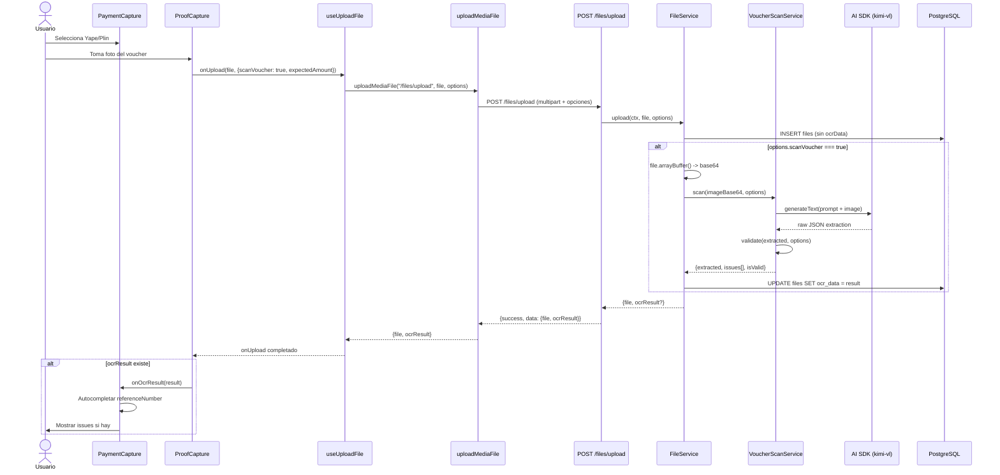

# Plan: OCR de Vouchers Yape/Plin integrado en Upload de Archivos

**Autor:** Droid  
**Fecha:** 2026-05-06  
**Estado:** Aprobado  
**Rama sugerida:** `feat/voucher-ocr`

---

## 1. Resumen Ejecutivo

Extender el sistema de archivos (`files`) para que al subir una imagen, opcionalmente se ejecute OCR de voucher (Yape/Plin) usando AI SDK con `generateText` + modelo vision (`kimi-vl`). El resultado OCR se persiste en una columna JSONB `ocrData` en la tabla `files` y se retorna junto con el file al frontend. El frontend puede solicitar el escaneo via un flag en el upload.

**Flujo de alto nivel:**
```
Frontend sube imagen con scanVoucher=true
  -> Backend guarda file en R2 + DB
  -> Backend convierte imagen a base64
  -> Backend ejecuta AI SDK (kimi-vl) para extraer datos
  -> Backend valida datos extraidos
  -> Backend guarda ocrData en file
  -> Backend retorna { file, ocrResult }
  -> Frontend autocompleta datos del pago o muestra issues
```

---

## 2. Datos Comunes en Vouchers Yape/Plin (Peru)

| Campo | Yape | Plin | Obligatorio | Deteccion |
|-------|------|------|-------------|-----------|
| **Metodo de pago** | Logo/texto "Yape" | Logo/texto "Plin" | Si | Por colores (morado #6B1FAF vs verde #00A650) y texto |
| **Monto** | S/ XX.XX | S/ XX.XX | Si | Numero con prefijo S/ o soles |
| **Numero de operacion** | Codigo alfanumerico ~10-12 chars | Codigo numerico largo | Si | Codigo de confirmacion |
| **Fecha** | DD/MM/YYYY | DD/MM/YYYY | Si | Fecha de la transaccion |
| **Hora** | HH:MM | HH:MM | No | Hora de la transaccion |
| **Telefono emisor** | 9XX XXX XXX | 9XX XXX XXX | No | Quien envia el pago |
| **Telefono receptor** | 9XX XXX XXX | 9XX XXX XXX | No | Quien recibe el pago |
| **Nombre emisor** | Nombre del pagador | Nombre del pagador | No | Nombre completo |
| **Nombre receptor** | Nombre del cobrador | Nombre del cobrador | No | Nombre completo |
| **Mensaje/Nota** | Opcional | Opcional | No | Texto libre |
| **Estado** | "Operacion exitosa" | "Transferencia exitosa" | Si | Validar que sea exitosa |

---

## 3. Archivos Nuevos

| # | Archivo | Descripcion |
|---|---------|-------------|
| 1 | `packages/backend/src/services/business/voucher-scan.service.ts` | Servicio principal de OCR con AI SDK |
| 2 | `packages/backend/src/services/business/voucher-scan.service.test.ts` | Tests del servicio |
| 3 | `packages/backend/src/lib/voucher-validator.ts` | Validaciones puras de datos extraidos |
| 4 | `packages/backend/src/db/migrations/0003_add_ocr_data_to_files.sql` | Migracion SQL para columna ocr_data |
| 5 | `packages/app/app/hooks/use-voucher-scan.ts` | Hook frontend para escanear vouchers |
| 6 | `packages/app/app/components/payments/voucher-scan-result.tsx` | Componente visual de resultado OCR |

---

## 4. Archivos Modificados - Backend

### 4.1 Schema de Base de Datos

**Archivo:** `packages/backend/src/db/schema/files.ts`

**Cambio:** Agregar columna `ocrData` de tipo `jsonb` (nullable).

```typescript
// ANTES
import { pgTable, uuid, varchar, integer, timestamp, text, index } from "drizzle-orm/pg-core";

// DESPUES
import { pgTable, uuid, varchar, integer, timestamp, text, index, jsonb } from "drizzle-orm/pg-core";

// EN LA TABLA files:
ocrData: jsonb("ocr_data"), // nullable, guarda VoucherScanResult
```

**Impacto:**
- La columna es nullable, no afecta datos existentes.
- Exportacion de tipos en `schema/index.ts` se actualiza automaticamente (type inference).

---

### 4.2 Repositorio de Files

**Archivo:** `packages/backend/src/services/repository/file.repository.ts`

**Cambio:** El metodo `update()` ya soporta `Partial<NewFileRecord>`, por lo que `ocrData` se puede actualizar sin cambios. **No requiere modificacion.**

**Impacto:** Ninguno. El repositorio ya es generico.

---

### 4.3 Servicio de Files

**Archivo:** `packages/backend/src/services/business/file.service.ts`

**Cambios:**
1. Inyectar `VoucherScanService` en el constructor.
2. Agregar interfaz `UploadOptions` con flags de OCR.
3. Modificar `upload()` para ejecutar OCR condicionalmente.
4. Cambiar retorno de `FileRecord` a `UploadResult` (con `ocrResult` opcional).

```typescript
// NUEVAS INTERFACES
export interface UploadOptions {
  scanVoucher?: boolean;
  expectedAmount?: number;
  expectedPaymentMethod?: "yape" | "plin";
}

export interface UploadResult {
  file: FileRecord;
  ocrResult?: VoucherScanResult;
}

// CONSTRUCTOR CAMBIA
constructor(
  private repository: FileRepository,
  private voucherScanService: VoucherScanService,
) {}

// upload() AHORA RETORNA UploadResult
async upload(ctx: RequestContext, file: File, options?: UploadOptions): Promise<UploadResult>
```

**Impacto:**
- Todos los llamadores de `upload()` deben manejar el nuevo retorno `UploadResult`.
- `uploadForOnboarding()` NO se modifica (no aplica OCR en onboarding).

---

### 4.4 API de Files

**Archivo:** `packages/backend/src/api/files.ts`

**Cambios:**
1. Extender el body del POST `/upload` para aceptar flags de OCR.
2. Pasar opciones a `fileService.upload()`.
3. Retornar `ocrResult` en la respuesta si aplica.

```typescript
// BODY NUEVO
body: t.Object({
  file: t.File({...}),
  scanVoucher: t.Optional(t.Boolean()),
  expectedAmount: t.Optional(t.Number()),
  expectedPaymentMethod: t.Optional(t.Union([t.Literal("yape"), t.Literal("plin")])),
})

// RESPUESTA NUEVA
return {
  success: true,
  data: {
    file: { id, filename, mimeType, sizeBytes, createdAt },
    ocrResult: result.ocrResult, // undefined si no escaneo
  },
}
```

**Impacto:**
- El endpoint `/files/upload` ahora retorna `{ data: { file, ocrResult? } }` en lugar de `{ id, filename, ... }`.
- **BREAKING CHANGE para frontend:** Todos los consumidores del endpoint deben actualizar su parsing de respuesta.

---

### 4.5 Plugin de Servicios (DI)

**Archivo:** `packages/backend/src/plugins/services.ts`

**Cambios:**
1. Importar `VoucherScanService`.
2. Instanciar `voucherScanService`.
3. Pasarlo al constructor de `FileService`.
4. Exponer `voucherScanService` en el decorate.

```typescript
import { VoucherScanService } from "../services/business/voucher-scan.service";

const voucherScanService = new VoucherScanService();
const fileService = new FileService(fileRepo, voucherScanService);

return {
  // ... existentes ...
  voucherScanService,
  fileService,
}
```

**Impacto:** Ninguno externo. Solo registro interno de DI.

---

### 4.6 API de OCR (ruta existente)

**Archivo:** `packages/backend/src/api/ocr.ts`

**Cambio opcional:** Agregar endpoint dedicado `/ocr/scan-voucher` para escaneo sin upload (si se quiere reusar el servicio sin guardar file).

```typescript
.post("/scan-voucher", async ({ voucherScanService, body }) => {
  const result = await voucherScanService.scan(body.imageBase64, {
    expectedAmount: body.expectedAmount,
    expectedPaymentMethod: body.expectedPaymentMethod,
  });
  return { success: true, data: result };
})
```

**Impacto:** Endpoint nuevo, no afecta existentes.

---

## 5. Archivos Modificados - Frontend

### 5.1 Cliente de Media

**Archivo:** `packages/app/app/lib/media/media-client.ts`

**Cambio:** Extender `uploadMediaFile` para soportar opciones de OCR.

```typescript
// ANTES
export async function uploadMediaFile(endpoint: "/files/upload" | "/assets/upload", file: File): Promise<UploadResponse>

// DESPUES
export interface UploadMediaOptions {
  scanVoucher?: boolean;
  expectedAmount?: number;
  expectedPaymentMethod?: "yape" | "plin";
}

export async function uploadMediaFile(
  endpoint: "/files/upload" | "/assets/upload",
  file: File,
  options?: UploadMediaOptions
): Promise<UploadResponse & { ocrResult?: VoucherScanResult }>
```

**Impacto:**
- `uploadMediaFile` ahora envia opciones como query params o form fields.
- Todos los llamadores existentes siguen funcionando (options es opcional).

---

### 5.2 Hook useUploadFile

**Archivo:** `packages/app/app/hooks/use-files.ts`

**Cambios:**
1. Extender `UploadFileOptions` para incluir opciones de OCR.
2. Pasar opciones a `uploadMediaFile`.
3. Actualizar tipo de retorno para incluir `ocrResult`.

```typescript
// ANTES
export interface UploadFileOptions {
  entityType: string;
  entityId?: string;
  fieldName: string;
}

// DESPUES
export interface UploadFileOptions {
  entityType?: string;
  entityId?: string;
  fieldName?: string;
  scanVoucher?: boolean;
  expectedAmount?: number;
  expectedPaymentMethod?: "yape" | "plin";
}

// uploadFileNow AHORA PASA OPCIONES
export async function uploadFileNow(
  file: File,
  options?: UploadFileOptions
): Promise<FileUploadResponse & { ocrResult?: VoucherScanResult }> {
  return uploadMediaFile("/files/upload", file, options);
}
```

**Impacto:**
- Todos los componentes que usan `useUploadFile()` o `uploadFileNow()` deben actualizar su manejo de respuesta si quieren usar OCR.
- Los usos existentes sin OCR siguen funcionando igual.

---

### 5.3 Componente ProofCapture

**Archivo:** `packages/app/app/components/payments/proof-capture.tsx`

**Cambios:**
1. Agregar props para OCR:
   - `scanVoucher?: boolean`
   - `expectedAmount?: number`
   - `onOcrResult?: (result: VoucherScanResult) => void`
2. Al subir file, pasar opciones de OCR al `onUpload`.
3. Mostrar resultado OCR si existe (usar nuevo componente `VoucherScanResult`).

```typescript
interface ProofCaptureProps {
  proofImageId: string | null;
  onUpload: (file: File, options?: { scanVoucher?: boolean; expectedAmount?: number }) => void;
  onRemove: () => void;
  isUploading?: boolean;
  scanVoucher?: boolean;
  expectedAmount?: number;
  onOcrResult?: (result: VoucherScanResult) => void;
}
```

**Impacto:**
- Componentes padres deben actualizar su callback `onUpload` para aceptar el segundo parametro opcional.
- Nuevo comportamiento visual: mostrar tags de validacion OCR.

---

### 5.4 Componente PaymentCapture

**Archivo:** `packages/app/app/components/payments/payment-capture.tsx`

**Cambios:**
1. Agregar props para OCR:
   - `expectedAmount?: number`
   - `onOcrResult?: (result: VoucherScanResult) => void`
2. Pasar `scanVoucher=true` cuando el metodo es Yape/Plin.
3. Manejar `ocrResult` para autocompletar `referenceNumber` y `paymentMethod`.
4. Mostrar issues de OCR al usuario.

```typescript
// NUEVAS PROPS
interface PaymentCaptureProps {
  // ... existentes ...
  expectedAmount?: number;
  onOcrResult?: (result: VoucherScanResult) => void;
}
```

**Impacto:**
- Todos los componentes que usan `PaymentCapture` pueden beneficiarse del OCR automatico.
- El componente se vuelve mas complejo pero mantiene backward compatibility.

---

### 5.5 Componente PaymentModeSection (Ventas)

**Archivo:** `packages/app/app/components/sales/new-sale/payment-mode-section.tsx`

**Cambios:**
1. Pasar `expectedAmount: calculations.totalAmount` a `PaymentCapture` cuando el metodo es Yape/Plin.
2. Manejar `onOcrResult` para prellenar `referenceNumber` y validar monto.

```typescript
<PaymentCapture
  // ... existentes ...
  expectedAmount={calculations.totalAmount}
  onOcrResult={(result) => {
    if (result.extracted.operationNumber) {
      updatePaymentForm({ referenceNumber: result.extracted.operationNumber });
    }
    if (result.extracted.amount && result.extracted.amount !== calculations.totalAmount) {
      // Mostrar warning de monto diferente
    }
  }}
/>
```

**Impacto:** Mejora UX en flujo de ventas con pago Yape/Plin.

---

### 5.6 Otras rutas que usan useUploadFile

**Archivos afectados:**
- `packages/app/app/routes/_protected.gastos.$id._index.tsx`
- `packages/app/app/routes/_protected.cobros.nuevo.tsx`
- `packages/app/app/components/expenses/expense-capture.tsx`
- `packages/app/app/components/payments/qr-image-upload.tsx`
- `packages/app/app/components/payments/form-payment-capture.tsx`
- `packages/app/app/lib/forms/media-field-resolvers.ts`

**Impacto:**
- Ninguno si no quieren usar OCR.
- Si quieren usar OCR en el futuro (ej: comprobantes de gastos), ya tienen la infraestructura lista.

---

## 6. Diagrama de Flujo Completo



---

## 7. Modelo de Datos OCR

```typescript
// packages/backend/src/services/business/voucher-scan.service.ts

export type DetectedPaymentMethod = "yape" | "plin" | "unknown";

export interface VoucherExtraction {
  paymentMethod: DetectedPaymentMethod;
  amount: number | null;
  operationNumber: string | null;
  date: string | null;        // ISO 8601
  time: string | null;
  senderPhone: string | null;
  senderName: string | null;
  receiverPhone: string | null;
  receiverName: string | null;
  status: "exitosa" | "pendiente" | "fallida" | "unknown";
  notes: string | null;
  confidence: number;         // 0.0 - 1.0 promedio
}

export type VoucherIssueSeverity = "error" | "warning" | "info";

export interface VoucherIssue {
  field: string;
  severity: VoucherIssueSeverity;
  message: string;
  suggestion?: string;
}

export interface VoucherScanResult {
  extracted: VoucherExtraction;
  issues: VoucherIssue[];
  isValid: boolean;
  scannedAt: string;          // ISO timestamp
}
```

---

## 8. Validaciones del Voucher

| # | Regla | Issue | Severity | Condicion |
|---|-------|-------|----------|-----------|
| 1 | Metodo detectado | `paymentMethod === "unknown"` | error | Siempre |
| 2 | Monto leido | `amount === null` | error | Siempre |
| 3 | Monto coincide | `expectedAmount && abs(diff) > 0.01` | error | Si `expectedAmount` proporcionado |
| 4 | Numero de operacion | `operationNumber === null` | warning | Siempre |
| 5 | Fecha detectada | `date === null` | warning | Siempre |
| 6 | Estado exitoso | `status !== "exitosa"` | error | Siempre |
| 7 | Confianza alta | `confidence < 0.5` | warning | Siempre |
| 8 | Fecha reciente | `date && !isTodayOrRecent(date)` | warning | Si `date` detectada |

---

## 9. Prompt de IA (Vision)

```
Eres un experto en reconocimiento de vouchers de pago movil de Peru (Yape y Plin).
Analiza la imagen y extrae la siguiente informacion en JSON estricto:

{
  "paymentMethod": "yape" | "plin" | "unknown",
  "amount": number | null,
  "operationNumber": string | null,
  "date": "YYYY-MM-DD" | null,
  "time": "HH:MM" | null,
  "senderPhone": string | null,
  "senderName": string | null,
  "receiverPhone": string | null,
  "receiverName": string | null,
  "status": "exitosa" | "pendiente" | "fallida" | "unknown",
  "notes": string | null,
  "confidence": 0.0-1.0
}

Reglas:
- Yape tiene fondo morado (#6B1FAF), Plin tiene fondo verde (#00A650).
- El monto esta en soles peruanos (S/ XX.XX).
- La fecha en formato ISO 8601 (YYYY-MM-DD).
- confidence es tu certeza promedio de la extraccion.
- Usa null si no puedes determinar un valor con certeza.
- Responde SOLO con el JSON, sin texto adicional.
```

---

## 10. Tareas de Implementacion

### Fase 1: Backend Core
| # | Tarea | Archivo | Prioridad |
|---|-------|---------|-----------|
| 1.1 | Agregar columna `ocrData` a schema `files` | `db/schema/files.ts` | Alta |
| 1.2 | Crear migracion SQL | `db/migrations/0003_add_ocr_data_to_files.sql` | Alta |
| 1.3 | Crear `VoucherScanService` | `services/business/voucher-scan.service.ts` | Alta |
| 1.4 | Crear `voucher-validator.ts` | `lib/voucher-validator.ts` | Alta |
| 1.5 | Extender `FileService.upload()` con OCR | `services/business/file.service.ts` | Alta |
| 1.6 | Extender endpoint `/files/upload` | `api/files.ts` | Alta |
| 1.7 | Registrar `VoucherScanService` en DI | `plugins/services.ts` | Alta |
| 1.8 | Agregar endpoint `/ocr/scan-voucher` (opcional) | `api/ocr.ts` | Media |

### Fase 2: Frontend Core
| # | Tarea | Archivo | Prioridad |
|---|-------|---------|-----------|
| 2.1 | Extender `uploadMediaFile` con opciones OCR | `lib/media/media-client.ts` | Alta |
| 2.2 | Extender `useUploadFile` hook | `hooks/use-files.ts` | Alta |
| 2.3 | Crear hook `useVoucherScan` | `hooks/use-voucher-scan.ts` | Media |
| 2.4 | Crear componente `VoucherScanResult` | `components/payments/voucher-scan-result.tsx` | Media |
| 2.5 | Modificar `ProofCapture` para OCR | `components/payments/proof-capture.tsx` | Alta |
| 2.6 | Modificar `PaymentCapture` para OCR | `components/payments/payment-capture.tsx` | Alta |
| 2.7 | Modificar `PaymentModeSection` para enviar expectedAmount | `components/sales/new-sale/payment-mode-section.tsx` | Alta |

### Fase 3: Tests y Verificacion
| # | Tarea | Archivo | Prioridad |
|---|-------|---------|-----------|
| 3.1 | Tests de `VoucherScanService` | `services/business/voucher-scan.service.test.ts` | Alta |
| 3.2 | Tests de `voucher-validator.ts` | `lib/voucher-validator.test.ts` | Media |
| 3.3 | Verificar build backend | `bun run build` | Alta |
| 3.4 | Verificar typecheck backend | `bun run typecheck` | Alta |
| 3.5 | Verificar build frontend | `bun run build` | Alta |
| 3.6 | Verificar typecheck frontend | `tsc --noEmit` | Alta |
| 3.7 | Aplicar migracion en dev | `bun run db:migrate` | Alta |

---

## 11. Analisis de Impacto

### 11.1 Breaking Changes

| # | Cambio | Archivos Afectados | Mitigacion |
|---|--------|-------------------|------------|
| 1 | `/files/upload` ahora retorna `{ data: { file, ocrResult? } }` | Todos los consumidores del endpoint | El frontend `uploadMediaFile` y `uploadFileNow` manejan el nuevo formato. Los usos existentes solo ignoran `ocrResult`. |
| 2 | `FileService.upload()` ahora retorna `UploadResult` en vez de `FileRecord` | `file.service.ts`, `plugins/services.ts` | Actualizar llamadores internos. El endpoint `/files/upload` es el unico llamador externo. |
| 3 | `FileService` constructor ahora requiere `VoucherScanService` | `plugins/services.ts` | Actualizar instanciacion en DI. |

### 11.2 Riesgos y Mitigaciones

| Riesgo | Probabilidad | Impacto | Mitigacion |
|--------|-------------|---------|------------|
| AI SDK no responde o tarda mucho | Media | Alto | Timeout de 15s en `generateText`. Si falla, el upload sigue funcionando sin OCR (graceful degradation). |
| MOONSHOT_API_KEY no configurada | Baja | Alto | El servicio verifica la key antes de llamar. Si no existe, retorna error claro sin romper el upload. |
| OCR retorna datos incorrectos | Media | Medio | Validaciones estrictas + `confidence` score. El usuario siempre puede corregir manualmente. |
| Aumento de costo de API | Media | Medio | OCR es opt-in (`scanVoucher: true`). Solo se ejecuta cuando el frontend lo solicita. |
| Migracion de DB falla | Baja | Alto | Migracion es `ALTER TABLE ADD COLUMN` nullable. No afecta datos existentes. |

### 11.3 Dependencias

| Dependencia | Version | Uso |
|-------------|---------|-----|
| `ai` | ^6.0.116 | `generateText` (ya instalado) |
| `@ai-sdk/moonshotai` | ^2.0.10 | Modelo `kimi-vl` (ya instalado) |
| `drizzle-orm` | ^0.45.1 | Schema JSONB (ya instalado) |

**No se requieren nuevas dependencias.**

### 11.4 Performance

- OCR con AI SDK toma ~2-5 segundos dependiendo de la imagen.
- El upload de archivo a R2 es independiente y rapido.
- Se recomienda ejecutar OCR **despues** de guardar el file, para no bloquear el upload.
- El frontend puede mostrar un estado de "Analizando voucher..." mientras espera.

---

## 12. Checklist Pre-Merge

- [ ] Todos los tests pasan (`bun test` en backend y app)
- [ ] Typecheck sin errores (`bun run typecheck` en backend, `tsc --noEmit` en app)
- [ ] Build exitoso (`bun run build` en ambos paquetes)
- [ ] Migracion aplicada en dev (`bun run db:migrate`)
- [ ] MOONSHOT_API_KEY configurada en environment
- [ ] Frontend maneja correctamente respuesta con y sin `ocrResult`
- [ ] Graceful degradation: upload funciona sin OCR si AI falla
- [ ] Documentacion actualizada (este plan)

---

## 13. Notas de Implementacion

### 13.1 Conversion File -> Base64

```typescript
private async fileToBase64(file: File): Promise<string> {
  const buffer = await file.arrayBuffer();
  const base64 = Buffer.from(buffer).toString("base64");
  const mimeType = file.type || "image/jpeg";
  return `data:${mimeType};base64,${base64}`;
}
```

### 13.2 Graceful Degradation

Si el OCR falla (AI no responde, error de parseo, etc.), el upload del archivo **no debe fallar**. El `ocrResult` simplemente no se incluye en la respuesta.

```typescript
try {
  const ocrResult = await this.voucherScanService.scan(imageBase64, options);
  await this.repository.update(ctx, fileRecord.id, { ocrData: ocrResult });
  return { file: fileRecord, ocrResult };
} catch (err) {
  console.error("OCR failed, but file uploaded successfully:", err);
  return { file: fileRecord };
}
```

### 13.3 Seguridad

- El OCR solo se ejecuta para imagenes (mime type `image/*`).
- El prompt de IA no incluye datos sensibles del negocio.
- La imagen base64 no se almacena, solo se pasa al modelo y se descarta.
- El resultado OCR se guarda en la misma tabla `files` con el mismo tenant isolation (`businessId`).

---

*Plan generado el 2026-05-06. Aprobado para implementacion.*
