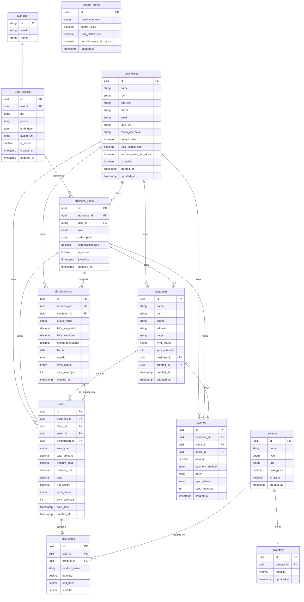

# PollosPro - Esquema de Base de Datos

> Documentación del modelo de datos PostgreSQL con Drizzle ORM

---

## 📋 Índice

1. [Arquitectura General](#arquitectura-general)
2. [Diagrama ER](#diagrama-er)
3. [Tablas de Better Auth](#tablas-de-better-auth)
4. [Tablas del Sistema](#tablas-del-sistema)
5. [Enums](#enums)
6. [Relaciones](#relaciones)
7. [Sync Offline](#sync-offline)

---

## Arquitectura General

El esquema está diseñado para soportar:

- **Multi-tenancy**: Un usuario puede pertenecer a múltiples negocios
- **Offline-first**: Tablas con `sync_status` para sincronización
- **Better Auth**: Autenticación delegada a Better Auth

### Convenciones

| Convención | Descripción |
|------------|-------------|
| PK | UUID con `defaultRandom()` |
| Timestamps | `created_at`, `updated_at` en todas las tablas |
| Soft Delete | `is_active` booleano |
| FK Nullable | Campos `_id` son nullable cuando la relación es opcional |

---

## Diagrama ER



---

## Tablas de Better Auth

Better Auth crea automáticamente estas tablas:

| Tabla | Propósito |
|-------|-----------|
| `user` | Usuarios (email, contraseña hash) |
| `session` | Sesiones activas |
| `account` | Cuentas vinculadas (OAuth) |
| `verification` | Tokens de verificación |

> **Nota**: Nuestro schema NO define estas tablas. Se accede vía `user_profiles.user_id`.

---

## Tablas del Sistema

### `user_profiles`
Datos personales del usuario, independientes del negocio.

| Campo | Tipo | Descripción |
|-------|------|-------------|
| `id` | uuid PK | ID interno |
| `user_id` | varchar(255) | FK a `auth.user.id` (Better Auth) |
| `dni` | varchar(20) | Documento personal |
| `phone` | varchar(50) | Teléfono personal |
| `birth_date` | date | Fecha de nacimiento |
| `avatar_url` | varchar(255) | Foto de perfil |
| `is_active` | boolean | Estado de cuenta |
| `created_at` | timestamp | |
| `updated_at` | timestamp | |

### `businesses`
Negocios/pollos. Soporta multi-tenancy.

| Campo | Tipo | Descripción |
|-------|------|-------------|
| `id` | uuid PK | |
| `name` | varchar(100) | Nombre del negocio |
| `ruc` | varchar(20) | RUC/DNI fiscal |
| `address` | text | Dirección fiscal |
| `phone` | varchar(20) | Teléfono del negocio |
| `email` | varchar(100) | Email del negocio |
| `logo_url` | varchar(255) | Logo |
| `modo_operacion` | varchar(50) | Config específica del negocio |
| `control_kilos` | boolean | |
| `usar_distribucion` | boolean | |
| `permitir_venta_sin_stock` | boolean | |
| `is_active` | boolean | |
| `created_at` | timestamp | |
| `updated_at` | timestamp | |

### `business_users`
Relación muchos-a-muchos: usuarios pueden estar en múltiples negocios.

| Campo | Tipo | Descripción |
|-------|------|-------------|
| `id` | uuid PK | |
| `business_id` | uuid FK → businesses | |
| `user_id` | varchar(255) FK → auth.user | ID de Better Auth |
| `role` | enum | ADMIN_NEGOCIO, VENDEDOR |
| `sales_point` | varchar(100) | Carro A, Casa, etc. |
| `commission_rate` | decimal(5,2) | % comisión en este negocio |
| `is_active` | boolean | |
| `joined_at` | timestamp | |
| `updated_at` | timestamp | |

### `customers`
Clientes con soporte offline.

| Campo | Tipo | Descripción |
|-------|------|-------------|
| `id` | uuid PK | |
| `name` | varchar(255) | |
| `dni` | varchar(20) | |
| `phone` | varchar(50) | |
| `address` | text | |
| `notes` | text | |
| `sync_status` | enum | pending, synced, error |
| `sync_attempts` | integer | |
| `business_id` | uuid FK → businesses | Negocio al que pertenece |
| `created_by` | uuid FK → business_users | Quien creó el cliente |
| `created_at` | timestamp | |
| `updated_at` | timestamp | |

### Multi-tenancy Pattern

Todas las tablas operativas (`customers`, `sales`, `abonos`, `distribuciones`) tienen `business_id` para filtrar datos por negocio. Esto permite:
- Que un usuario trabaje en múltiples negocios
- Que cada negocio vea solo sus propios datos
- Queries simples: `WHERE business_id = ?`

### `sales`
Ventas (contado/crédito) con soporte offline.

| Campo | Tipo | Descripción |
|-------|------|-------------|
| `id` | uuid PK | |
| `business_id` | uuid FK → businesses | Negocio al que pertenece |
| `client_id` | uuid FK → customers | Nullable (ventas sin cliente) |
| `seller_id` | uuid FK → business_users | Quien vende (dentro del negocio) |
| `distribucion_id` | uuid FK → distribuciones | Nullable |
| `sale_type` | enum | contado, credito |
| `total_amount` | decimal(12,2) | |
| `amount_paid` | decimal(12,2) | |
| `balance_due` | decimal(12,2) | Saldo pendiente |
| `tara` | decimal(10,3) | Tara en kg |
| `net_weight` | decimal(10,3) | Peso neto en kg |
| `sync_status` | enum | pending, synced, error |
| `sync_attempts` | integer | |
| `sale_date` | timestamp | Fecha de la venta |
| `created_at` | timestamp | |

### `sale_items`
Líneas de cada venta.

| Campo | Tipo | Descripción |
|-------|------|-------------|
| `id` | uuid PK | |
| `sale_id` | uuid FK → sales | |
| `product_id` | uuid FK → products | |
| `product_name` | varchar(255) | Denormalizado para offline |
| `quantity` | decimal(10,3) | Cantidad/kg |
| `unit_price` | decimal(10,2) | Precio unitario |
| `subtotal` | decimal(12,2) | |

### `abonos`
Pagos de deuda independientes de ventas.

| Campo | Tipo | Descripción |
|-------|------|-------------|
| `id` | uuid PK | |
| `business_id` | uuid FK → businesses | Negocio al que pertenece |
| `client_id` | uuid FK → customers | |
| `seller_id` | uuid FK → business_users | Quien recibe el pago |
| `amount` | decimal(12,2) | Monto del abono |
| `payment_method` | enum | efectivo, yape, plin, transferencia |
| `notes` | text | |
| `sync_status` | enum | pending, synced, error |
| `sync_attempts` | integer | |
| `created_at` | timestamp | |

### `products`
Catálogo de productos.

| Campo | Tipo | Descripción |
|-------|------|-------------|
| `id` | uuid PK | |
| `name` | varchar(255) | |
| `type` | enum | pollo, huevo, otro |
| `unit` | enum | kg, unidad |
| `base_price` | decimal(10,2) | Precio base sugerido |
| `is_active` | boolean | |
| `created_at` | timestamp | |

### `inventory`
Stock actual por producto.

| Campo | Tipo | Descripción |
|-------|------|-------------|
| `id` | uuid PK | |
| `product_id` | uuid FK → products | |
| `quantity` | decimal(10,3) | Cantidad disponible |
| `updated_at` | timestamp | |

### `distribuciones`
Asignación diaria de kilos a vendedores.

| Campo | Tipo | Descripción |
|-------|------|-------------|
| `id` | uuid PK | |
| `business_id` | uuid FK → businesses | Negocio al que pertenece |
| `vendedor_id` | uuid FK → business_users | |
| `punto_venta` | varchar(100) | Carro A, Casa, etc. |
| `kilos_asignados` | decimal(10,3) | |
| `kilos_vendidos` | decimal(10,3) | |
| `monto_recaudado` | decimal(12,2) | |
| `fecha` | date | Fecha de distribución |
| `estado` | enum | activo, cerrado, en_ruta |
| `sync_status` | enum | pending, synced, error |
| `sync_attempts` | integer | |
| `created_at` | timestamp | |

### `system_config`
Configuración global del sistema (1 registro).

| Campo | Tipo | Descripción |
|-------|------|-------------|
| `id` | uuid PK | |
| `modo_operacion` | enum | inventario_propio, sin_inventario, pedidos, mixto |
| `control_kilos` | boolean | |
| `usar_distribucion` | boolean | |
| `permitir_venta_sin_stock` | boolean | |
| `updated_at` | timestamp | |

---

## Enums

| Enum | Valores |
|------|---------|
| `user_role` | ADMIN, VENDEDOR |
| `business_user_role` | ADMIN_NEGOCIO, VENDEDOR |
| `sync_status` | pending, synced, error |
| `sale_type` | contado, credito |
| `payment_method` | efectivo, yape, plin, transferencia |
| `product_type` | pollo, huevo, otro |
| `product_unit` | kg, unidad |
| `distribucion_status` | activo, cerrado, en_ruta |
| `modo_operacion` | inventario_propio, sin_inventario, pedidos, mixto |

---

## Relaciones

### User → Business (Multi-tenancy)
```
auth.user 1:1 user_profiles
auth.user 1:* business_users
business 1:* business_users
```

### Business → Operations
```
businesses 1:* customers (business_id)
businesses 1:* sales (business_id)
businesses 1:* abonos (business_id)
businesses 1:* distribuciones (business_id)
business_users 1:* customers (created_by)
business_users 1:* sales (seller_id)
business_users 1:* abonos (seller_id)
business_users 1:* distribuciones (vendedor_id)
```

### Sales
```
sales 1:* sale_items
customers 1:* sales
distribuciones 1:* sales
```

### Products
```
products 1:1 inventory
products 1:* sale_items
```

---

## Sync Offline

Tablas con soporte offline (`sync_status`, `sync_attempts`):

| Tabla | Sincroniza |
|-------|------------|
| `customers` | ✅ |
| `sales` | ✅ |
| `abonos` | ✅ |
| `distribuciones` | ✅ |

### Flujo de Sync

1. **Crear registro**: `sync_status = 'pending'`
2. **Intentar sync**: Si éxito → `'synced'`, si error → `'error'` + incrementar `sync_attempts`
3. **Reintentar**: Con backoff exponencial

---

## Archivos del Schema

```
packages/backend/src/db/schema/
├── enums.ts           # Definiciones de enums
├── user-profiles.ts   # Perfiles de usuario
├── businesses.ts      # Negocios y business_users
├── customers.ts       # Clientes
├── sales.ts           # Ventas e items
├── payments.ts        # Abonos
├── inventory.ts       # Productos, stock, distribuciones
├── config.ts          # Configuración global
├── relations.ts       # Relaciones Drizzle
└── index.ts           # Exportaciones
```

---

## Tipos Exportados

Desde `@avileo/shared`:

```typescript
import type {
  Business,
  BusinessUser,
  Customer,
  Sale,
  Abono
} from "@avileo/shared";
```

---

*Última actualización: Febrero 2026*
