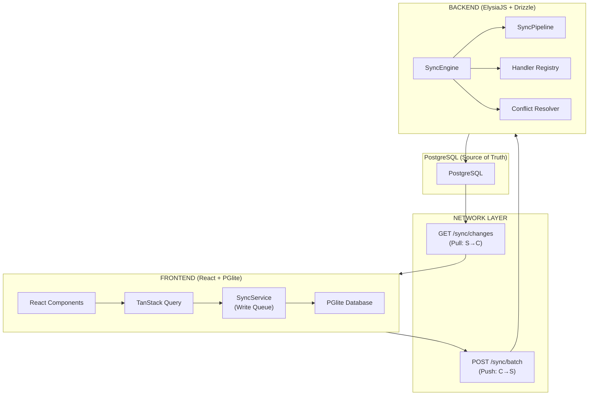
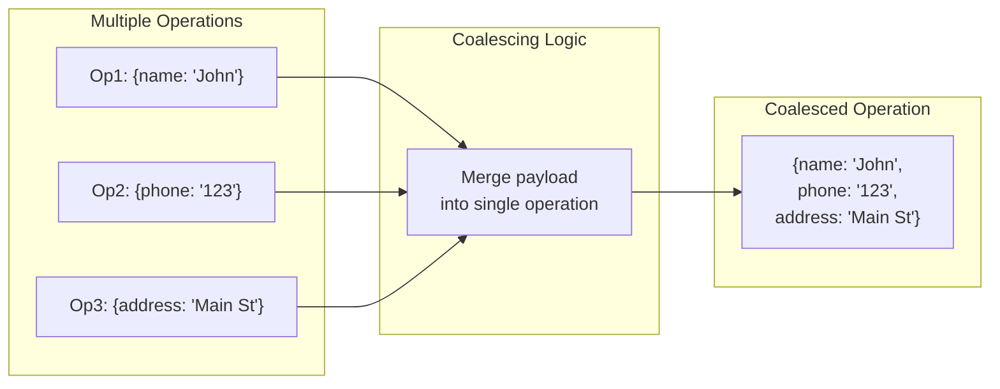
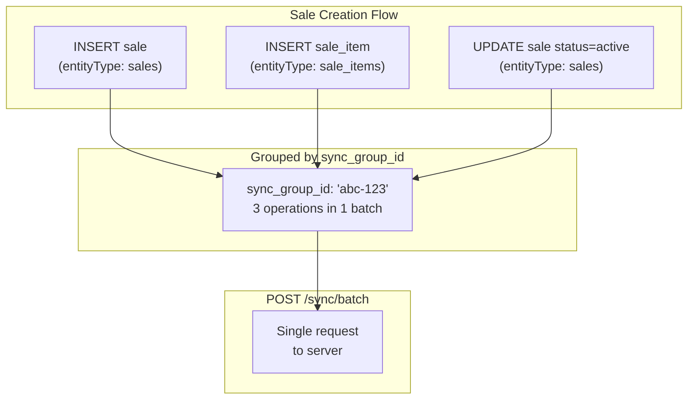
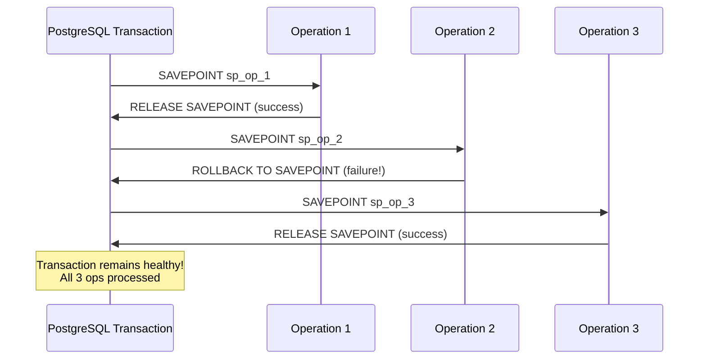
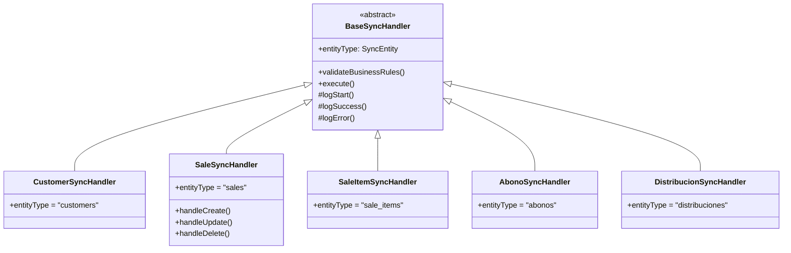

# Sync Mechanism Technical Analysis

> Comprehensive analysis of Avileo's offline-first synchronization architecture
> Generated: March 2026
> Last Updated: March 15, 2026
> Version: 2.0 (post-fix)

---

## Executive Summary

This document provides a comprehensive technical analysis of Avileo's synchronization mechanism, which enables offline-first functionality for mobile chicken vendors. The system implements a **hybrid architecture** combining:

1. **PGlite (PostgreSQL in WASM)** - Local database in the browser
2. **ElectricSQL** - Server-to-client real-time sync (historically used, now optional)
3. **Custom REST API Queue** - Client-to-server write operations
4. **Pull-based Sync** - Polling server changes via `/sync/changes`

### Architecture at a Glance



---

## 1. File Inventory by Layer

### 1.1 Frontend Layer

| File Path | Lines | Purpose |
|-----------|-------|---------|
| `packages/app/app/lib/sync/sync-service.ts` | 1283 | Main client-side sync service - push sync, queue management, group-by-syncGroupId batching |
| `packages/app/app/lib/sync/pull-service.ts` | 561 | Pull-based sync - fetches changes from server, UPSERT for missing records |
| `packages/app/app/lib/sync/config.ts` | 75 | Sync constants and configuration |
| `packages/app/app/lib/sync/registry.ts` | 43 | Entity registry for sync handlers (saleSyncHook disabled) |
| `packages/app/app/lib/sync/shape-config.ts` | 268 | ElectricSQL shape definitions (legacy) |
| `packages/app/app/lib/sync/manual-sync.ts` | 20 | Manual sync utilities |
| `packages/app/app/lib/sync/create-sync-hook.ts` | 69 | Sync hook factory |
| `packages/app/app/lib/services/base-service.ts` | 233 | Base service with `queueSync()` + `entityTypeOverride` support |
| `packages/app/app/lib/services/sale-service.ts` | 1300 | Sale service - createDraft, confirm, addItem with syncGroupId |
| `packages/app/app/hooks/use-sync-status.ts` | 230 | React hook for sync status monitoring |
| `packages/app/app/hooks/use-manual-sync.ts` | 127 | Hook for manual sync operations |
| `packages/app/app/hooks/use-pull-sync.ts` | 147 | Hook for pull sync |
| `packages/app/app/hooks/use-clear-sync-storage.ts` | 65 | Hook to clear sync storage |
| `packages/app/app/hooks/use-offline-aware-mutation.ts` | 44 | Hook for offline-aware mutations |
| `packages/app/app/components/sync/sync-status-indicator.tsx` | 245 | Sync status UI component |
| `packages/app/app/components/sync/sync-status.tsx` | 82 | Sync context and provider |
| `packages/app/app/components/sync/sync-devtools-drawer.tsx` | 1055 | Debug drawer for sync |
| `packages/app/app/components/sync/sync-error-monitor.tsx` | 91 | Error monitoring component |
| `packages/app/app/components/sync/pull-sync-wrapper.tsx` | 32 | Pull sync wrapper component |

### 1.2 Backend Layer

The backend sync system uses a **framework pattern** with handlers per entity type:

| File Path | Lines | Purpose |
|-----------|-------|---------|
| `packages/backend/src/api/sync.ts` | 213 | Sync API endpoints (batch, changes, health) |
| `packages/backend/src/services/sync/sync.service.ts` | 103 | Thin orchestrator - delegates to SyncEngine |
| `packages/backend/src/services/sync/types.ts` | 41 | Sync type definitions |
| `packages/backend/src/services/sync/sync-logger.ts` | 400 | Sync logging utilities with correlation tracking |
| `packages/backend/src/services/sync/schemas/index.ts` | 169 | Zod validation schemas for sync operations |
| **Framework** | | |
| `packages/backend/src/services/sync/framework/SyncEngine.ts` | 254 | Core batch processing with SAVEPOINTs per operation |
| `packages/backend/src/services/sync/framework/SyncPipeline.ts` | 71 | Pipeline execution (validate structure → validate business → execute) |
| `packages/backend/src/services/sync/framework/ConflictResolver.ts` | 130 | Conflict detection per entity type |
| `packages/backend/src/services/sync/framework/HandlerRegistry.ts` | 35 | Handler factory registration |
| `packages/backend/src/services/sync/framework/types.ts` | 75 | Framework type definitions (SyncContext, ISyncHandler, etc.) |
| **Handlers** | | |
| `packages/backend/src/services/sync/handlers/BaseSyncHandler.ts` | 139 | Base handler class with logging helpers |
| `packages/backend/src/services/sync/handlers/CustomerSyncHandler.ts` | 101 | Customer entity handler |
| `packages/backend/src/services/sync/handlers/SaleSyncHandler.ts` | 236 | Sale handler - preserves client entityId, handles credit payments |
| `packages/backend/src/services/sync/handlers/SaleItemSyncHandler.ts` | 179 | Sale item handler - no total recalculation on create |
| `packages/backend/src/services/sync/handlers/AbonoSyncHandler.ts` | 76 | Payment entity handler |
| `packages/backend/src/services/sync/handlers/DistribucionSyncHandler.ts` | 111 | Distribution entity handler |

### 1.3 Database Layer

| File Path | Tables/Schema |
|-----------|---------------|
| `packages/backend/src/db/schema/sync-operations.ts` | `sync_operations` - Operation queue |
| `packages/backend/src/db/schema/customers.ts` | `customers` with sync_status |
| `packages/backend/src/db/schema/sales.ts` | `sales`, `sale_items` with sync_status |
| `packages/backend/src/db/schema/payments.ts` | `abonos` with sync_status, `reference_number` UNIQUE |
| `packages/backend/src/db/schema/suppliers.ts` | `suppliers` with sync_status |
| `packages/backend/src/db/schema/purchases.ts` | `purchases`, `purchase_items` with sync_status |
| `packages/backend/src/db/schema/inventory.ts` | `products`, `distribuciones` with sync_status |
| `packages/app/app/lib/db/schema.ts` | Frontend PGlite schema definitions |

---

## 2. Sync Flow Analysis

### 2.1 Push Sync (Client → Server)

The push sync mechanism handles offline writes that need to be sent to the server:

```mermaid
sequenceDiagram
    participant User as User Action
    participant Service as Service Layer
    participant Queue as SyncService Queue
    participant Server as Backend API
    participant Engine as SyncEngine
    participant DB as PostgreSQL
    
    User->>Service: Create/Update/Delete
    Service->>Service: Validate data
    Service->>Queue: queueSync() with entityTypeOverride
    Queue->>Queue: Generate idempotencyKey
    Queue->>Queue: Coalesce operations
    Queue->>Queue: Store in PGlite sync_operations
    
    Note over Queue: Auto-sync (30s) or Manual trigger
    
    Queue->>Server: POST /sync/batch
    Server->>Engine: processBatch(operations)
    
    Engine->>DB: BEGIN TRANSACTION
    
    loop For each operation
        Engine->>Engine: SAVEPOINT sp_op_N
        Engine->>Engine: Check idempotency
        Engine->>Engine: Check conflicts
        Engine->>Engine: Validate via Pipeline
        Engine->>Engine: Execute via Handler
        
        alt Success
            Engine->>DB: RELEASE SAVEPOINT
        alt Failure
            Engine->>DB: ROLLBACK TO SAVEPOINT
        end
    end
    
    Engine->>DB: COMMIT
    
    Server-->>Queue: Return results (success/failure/conflict)
    
    alt Success
        Queue->>Queue: Mark completed, update sync_status
    alt Failure
        Queue->>Queue: Increment attempts, apply backoff
        Queue->>Queue: Max retries? Move to dead letter
    end
```

### 2.2 Pull Sync (Server → Client)

The pull sync mechanism fetches server-side changes:

```mermaid
sequenceDiagram
    participant Timer as Pull Timer (10s)
    participant Pull as PullService
    participant Server as Backend API
    participant DB as PostgreSQL
    participant PGlite as PGlite DB
    participant Query as TanStack Query
    
    Timer->>Pull: Trigger pull
    
    Pull->>Pull: Load cursor from localStorage
    Pull->>Server: GET /sync/changes?since={cursor}&limit=100
    
    Server->>DB: Query sync_operations
    DB->>Server: Filter by business_id, processed timestamp
    
    Server-->>Pull: Return changes + nextSince cursor
    
    loop For each change
        Pull->>Pull: Validate table name (whitelist)
        Pull->>Pull: Convert camelCase → snake_case
        alt Insert/Update
            Pull->>PGlite: UPSERT (ON CONFLICT DO UPDATE)
        alt Delete
            Pull->>PGlite: DELETE
        end
    end
    
    Pull->>Query: Invalidate affected queries
    
    Query-->>User: UI re-renders with fresh data
    
    Pull->>Pull: Persist nextSince cursor to localStorage
```

### 2.3 Operation Coalescing

The system merges multiple operations on the same entity to prevent unnecessary network traffic:



### 2.4 Sync Group Batching

Related operations are grouped by `sync_group_id` for atomic processing:



---

## 3. Key Components Deep Dive

### 3.1 SyncService (Frontend)

**Location:** `packages/app/app/lib/sync/sync-service.ts`

The `SyncService` class is the core of the client-side sync engine. Key features:

#### Configuration
```typescript
MAX_RETRIES = 5              // Max retry attempts before dead letter
BATCH_SIZE = 50              // Operations per batch
SYNC_INTERVAL_MS = 30000    // 30 second auto-sync
PULL_INTERVAL_MS = 10000    // 10 second pull interval
BACKOFF_BASE_MS = 1000       // Exponential backoff base
BACKOFF_MAX_MS = 30000       // Max backoff delay
```

#### Key Methods

| Method | Purpose |
|--------|---------|
| `enqueue(params)` | Add operation to sync queue with coalescing |
| `processPending()` | Groups operations by `sync_group_id`, sends each group as one batch |
| `sendBatchToServer(ops)` | POST to `/sync/batch` with array of operations |
| `resolveConflict()` | Resolve sync conflict |
| `getStatus()` | Get sync status counts |
| `getFailedOperations()` | Get failed operations for retry |
| `retryOperation(id)` | Retry single failed operation |
| `startAutoSync()` | Start periodic sync |
| `stopAutoSync()` | Stop periodic sync |

### 3.2 PullService (Frontend)

**Location:** `packages/app/app/lib/sync/pull-service.ts`

The `PullService` handles fetching server changes. Key features:

#### Valid Tables (Whitelist)
```typescript
const VALID_TABLES = new Set([
  "customers", "products", "product_variants",
  "sales", "sale_items", "abonos",
  "purchases", "purchase_items", "suppliers",
  "inventory", "variant_inventory",
  "distribuciones", "distribucion_items",
  "closings", "tags", "customer_tags"
]);
```

#### Cursor Management
- Cursor stored in `localStorage` under key `avileo_pull_cursor`
- Survives page refreshes and browser restarts
- Cleared on logout

### 3.3 SyncEngine (Backend)

**Location:** `packages/backend/src/services/sync/framework/SyncEngine.ts`

The backend sync engine processes incoming operation batches using a **framework pattern** with pluggable handlers:

```mermaid
flowchart TB
    subgraph Engine["SyncEngine.processBatch()"]
        Start["Start"] --> Tx["BEGIN TRANSACTION"]
        Tx --> Loop{"For each<br/>operation"}
        
        Loop --> SP["SAVEPOINT sp_op_N"]
        SP --> Idemp["Check Idempotency"]
        Idemp --> Conflict["ConflictResolver<br/>checkConflict()"]
        Conflict --> Pipeline["SyncPipeline.execute()"]
        
        subgraph Pipeline["Pipeline Stages"]
            Pipeline --> Validate1["validateStructure<br/>(Zod schema)"]
            Validate1 --> Validate2["validateBusinessRules<br/>(handler-specific)"]
            Validate2 --> Execute["handler.execute()"]
        end
        
        Execute --> CheckResult{"Success?"}
        
        CheckResult -->|Yes| Release["RELEASE SAVEPOINT"]
        CheckResult -->|No| Rollback["ROLLBACK TO SAVEPOINT"]
        
        Release --> NextOp["Next operation"]
        Rollback --> NextOp
        
        NextOp --> Loop
        Loop -->|Done| Commit["COMMIT TRANSACTION"]
    end
```

#### SAVEPOINT Per Operation

PostgreSQL transactions enter an "aborted" state when any query fails. Without savepoints, a failure in one operation would cause all subsequent operations in the batch to fail:



### 3.4 Sync Handlers

Each entity type has a dedicated handler extending `BaseSyncHandler`:



### 3.5 Handler Registry

```mermaid
flowchart TB
    subgraph Registry["HandlerRegistry"]
        Map["handlers: Map<SyncEntity, HandlerFactory>"]
    end
    
    subgraph Registration["At Startup"]
        Reg1["register('customers', () => new CustomerSyncHandler())"]
        Reg2["register('sales', () => new SaleSyncHandler(...))"]
        Reg3["register('abonos', () => new AbonoSyncHandler(...))"]
        Reg4["register('distribuciones', ... )"]
        Reg5["register('sale_items', ... )"]
    end
    
    subgraph Lookup["At Runtime"]
        Lookup["getHandler(entityType, deps)"]
    end
    
    Registration --> Map
    Lookup --> Map
```

---

## 4. Completeness Assessment

### 4.1 ✅ Implemented Features

| Feature | Status | Notes |
|---------|--------|-------|
| Local PGlite database | ✅ Complete | IndexedDB-backed PostgreSQL in WASM |
| Write queue (sync_operations) | ✅ Complete | Persistent queue with status tracking |
| Operation coalescing | ✅ Complete | Merges multiple ops on same entity |
| Push sync (POST /sync/batch) | ✅ Complete | Batch processing with SAVEPOINTs |
| Pull sync (GET /sync/changes) | ✅ Complete | Cursor-based pagination with UPSERT |
| Automatic retry with backoff | ✅ Complete | Exponential backoff up to 30s |
| Dead letter queue | ✅ Complete | After max retries |
| Conflict detection | ✅ Complete | Version-based conflict checking |
| Multi-tenancy filtering | ✅ Complete | business_id on all queries |
| Sync status UI | ✅ Complete | Badge, indicator components |
| Manual sync trigger | ✅ Complete | useManualSync hook |
| Auto-sync interval | ✅ Complete | 30 second push, 10 second pull |
| TanStack Query integration | ✅ Complete | Auto-invalidation on pull |
| Idempotency keys | ✅ Complete | Prevents duplicate processing |
| Offline detection | ✅ Complete | navigator.onLine check |
| Sync group batching | ✅ Complete | Operations grouped by sync_group_id |
| Entity type override | ✅ Complete | sale_items correctly typed via entityTypeOverride |
| Client ID preservation | ✅ Complete | Server uses client-generated UUIDs for sales |
| SAVEPOINT per operation | ✅ Complete | Partial failure isolation in batch transactions |
| Draft sale sync | ✅ Complete | Empty drafts can sync (saleSyncHook disabled) |

### 4.2 ⚠️ Partial/Incomplete Features

| Feature | Status | Notes |
|---------|--------|-------|
| Conflict resolution UI | ⚠️ Partial | UI exists but limited resolution options |
| Shape subscriptions (ElectricSQL) | ⚠️ Legacy | Deprecated in favor of pull-based sync |
| Sync metrics/monitoring | ⚠️ Basic | Basic logging, no metrics dashboard |
| Selective entity sync | ⚠️ Limited | All tables synced, no selective sync |
| Operation priority | ⚠️ Basic | Priority by sync_group_id only |

### 4.3 ❌ Missing Features

| Feature | Priority | Notes |
|---------|----------|-------|
| Real-time subscriptions | Low | Replaced by polling (sufficient for use case) |
| Full offline PWA | Medium | Needs Service Worker for full offline support |
| Batch download on first sync | Medium | No bulk data download for new devices |
| Sync encryption | Low | Data at rest not encrypted in IndexedDB |

---

## 5. Issues and Bug Analysis

### 5.1 Fixed Issues (March 2026)

| # | Issue | Location | Fix Applied |
|---|-------|----------|-------------|
| 1 | `saleSyncHook` blocked empty draft inserts | `registry.ts` | Hook commented out; drafts now sync immediately |
| 2 | `SaleService.getEntityType()` returned "sales" for sale_items | `base-service.ts` | Added `entityTypeOverride` parameter to `queueSync()` |
| 3 | Operations sent one-by-one, not grouped | `sync-service.ts:processPending()` | Rewrote to group by `sync_group_id` and send as single batch |
| 4 | Backend transaction aborted on first failure | `SyncEngine.ts:processBatch()` | SAVEPOINT per operation with ROLLBACK TO on failure |
| 5 | Pull service UPDATE failed for missing local records | `pull-service.ts` | Changed to UPSERT (INSERT ON CONFLICT DO UPDATE) |
| 6 | CORS missing `x-correlation-id` header | `cors.ts` | Added to allowed headers |
| 7 | `JSON.parse(JSON.stringify(op.payload)).substring()` crash | `sync-service.ts` | Safe string conversion before substring |
| 8 | `parseSaleInsert` required items for drafts | `SaleSyncHandler.ts` | Items no longer required; schema accepts empty arrays |
| 9 | `getInsertSyncGroupId` filtered by `status='pending'` | `sale-service.ts` | Removed status filter so syncGroupId found after insert synced |
| 10 | Sale ID not preserved during sync | `SaleSyncHandler.ts:handleCreate()` | Now passes `id: operation.entityId` to `saleRepo.create()` |
| 11 | Double-counting totals in `applySaleItemOperation` | `SaleItemSyncHandler.ts:handleCreate()` | Removed total recalculation; client totals are authoritative |
| 12 | `abonos.reference_number` missing unique constraint | `payments.ts` schema | Added `.unique()` to `reference_number` column |

### 5.2 Remaining Issues

#### 🟠 Medium Severity

| Issue | Location | Description | Impact |
|-------|----------|-------------|--------|
| Cursor not cleared on logout | `pull-service.ts` | Cursor persists, may miss changes after user switch | Stale data after user switch |
| No batch size validation on backend | `sync.ts` | Only frontend validates batch size | API abuse possible |

#### 🟡 Low Severity

| Issue | Location | Description | Impact |
|-------|----------|-------------|--------|
| Console.log in production | Multiple files | Debug logs not removed | Performance, noise |
| Limited error messages | `pull-service.ts` | Generic error messages | Poor debugging |

### 5.3 Previously Reported - Now Fixed

The following issues from v1.0 of this document have been resolved:

- **"No business_id filter in pull"** → business_id is correctly filtered server-side in `getChanges()`
- **"Missing error handling for large payloads"** → Payload logging truncated to 1000 chars
- **"No validation of entityType"** → Zod schema validation in `SyncPipeline.validateStructure()`
- **"Sync group not validated"** → Groups are now used for batching, validated by existence
- **"Weak conflict resolution"** → `SaleSyncHandler.handleUpdate()` creates sale if not found (upsert behavior)

---

## 6. Recommendations

### 6.1 High Priority

1. **~~Fix tenant data leak in pull sync~~** ✅ Fixed - Server filters by business_id
2. **Implement cursor reset on logout**
   - Clear pull cursor when user logs out
   - Clear all PGlite data on logout
3. **~~Add entity type validation~~** ✅ Fixed - Zod validation in SyncPipeline

### 6.2 Medium Priority

4. **Improve conflict resolution UI**
   - Show both server and client versions
   - Allow field-by-field merge

5. **Add batch download for new devices**
   - Bulk sync all relevant data on first login
   - Reduce initial sync time

6. **Re-enable saleSyncHook with proper queue blocking**
   - Currently disabled to allow draft syncing
   - Should be re-enabled once queue-level blocking (not reject) is implemented

### 6.3 Low Priority

7. **Remove console.log statements**
   - Use proper logging library
   - Add log level configuration

8. **Add sync metrics dashboard**
   - Track sync success rate
   - Monitor conflict frequency
   - Alert on high failure rates

9. **Consider Service Worker for full offline**
   - Cache app shell for offline access
   - Enable background sync

---

## 7. Data Flow Summary

### Sync Status Field Values

All sync-enabled tables have these fields:

| Field | Values | Description |
|-------|--------|-------------|
| `sync_status` | `pending`, `synced`, `error` | Current sync state |
| `sync_attempts` | Integer | Number of sync attempts |

### Operation Status Values

| Status | Description |
|--------|-------------|
| `pending` | Waiting to be processed |
| `processing` | Currently being sent to server |
| `syncing` | Being processed by server |
| `completed` | Successfully synced |
| `failed` | Sync failed (within retry limit) |
| `conflict` | Conflict detected, needs resolution |
| `dead_letter` | Max retries exceeded, requires manual intervention |

### Sync Interval Configuration

| Setting | Value | Description |
|---------|-------|-------------|
| `SYNC_INTERVAL_MS` | 30000 | Push sync every 30s |
| `PULL_INTERVAL_MS` | 10000 | Pull sync every 10s |
| `MAX_RETRIES` | 5 | Max attempts before dead letter |
| `BATCH_SIZE` | 50 | Operations per batch |
| `BACKOFF_BASE_MS` | 1000 | Initial backoff delay |
| `BACKOFF_MAX_MS` | 30000 | Maximum backoff delay |

---

## 8. Conclusion

Avileo's sync mechanism is **well-architected** and **production-ready** for its primary use case: enabling mobile chicken vendors to work offline with automatic synchronization when connectivity returns.

### Strengths

1. **Robust offline queue** - Operations persist in IndexedDB, survive page reloads
2. **Smart coalescing** - Multiple updates to same entity merged into one
3. **Sync group batching** - Related operations (sale + items + confirmation) sent atomically
4. **SAVEPOINT isolation** - Individual operation failures don't break the transaction
5. **Client ID preservation** - Server uses client-generated UUIDs, preventing FK mismatches
6. **Framework pattern** - Entity handlers are pluggable, pipeline validates before executing
7. **Conflict detection** - Prevents data loss from concurrent edits
8. **Dead letter queue** - Failed operations don't block the queue
9. **Exponential backoff** - Handles network instability gracefully

### Areas for Improvement

1. **UX** - Enhanced conflict resolution interface
2. **Reliability** - Cursor management on logout
3. **Observability** - Better logging and metrics
4. **saleSyncHook** - Re-enable with queue-level blocking instead of reject

The hybrid approach (push queue + pull polling) is appropriate for this use case and avoids the complexity of real-time WebSocket subscriptions while maintaining data consistency.

---

## 9. Applied Fixes Changelog (March 2026)

This section documents all fixes applied to the sync system during the March 2026 debugging session.

### Fix 1: saleSyncHook blocking draft inserts
- **Problem**: `saleSyncHook` in `registry.ts` prevented syncing "empty" sales (no customer/items), but drafts start empty. This blocked the insert, so only updates arrived at the server.
- **Fix**: Commented out the hook with TODO to re-enable when proper queue blocking is implemented.
- **Files**: `packages/app/app/lib/sync/registry.ts`

### Fix 2: entityTypeOverride for sale_items
- **Problem**: When `SaleService.addItem()` queued sync for sale_items, it used entity type `"sales"` instead of `"sale_items"` because `getEntityType()` returns `"sales"`.
- **Fix**: Added `entityTypeOverride` parameter to `BaseService.queueSync()`.
- **Files**: `packages/app/app/lib/services/base-service.ts`, `packages/app/app/lib/services/sale-service.ts`

### Fix 3: Client groups operations by sync_group_id
- **Problem**: `processPending()` sent each operation individually via `syncOperation(op)` → `sendBatchToServer([op])` — always batch of 1. Even though operations shared a `syncGroupId`, the client never grouped them.
- **Fix**: Rewrote `processPending()` to group by `sync_group_id` and send each group as a single `sendBatchToServer()` call.
- **Files**: `packages/app/app/lib/sync/sync-service.ts` (lines 454-604)

### Fix 4: CORS x-correlation-id header
- **Problem**: `x-correlation-id` wasn't in allowed CORS headers.
- **Fix**: Added to allowed headers.
- **Files**: `packages/backend/src/lib/cors.ts`

### Fix 5: JSON.parse().substring() crash
- **Problem**: `JSON.parse(JSON.stringify(op.payload)).substring()` failed when payload was object (`.substring()` is a string method).
- **Fix**: Safe string conversion before calling substring.
- **Files**: `packages/app/app/lib/sync/sync-service.ts`

### Fix 6: parseSaleInsert no longer requires items
- **Problem**: Backend threw "La venta requiere items" even for drafts.
- **Fix**: Removed the validation. Schema now accepts empty items arrays.
- **Files**: `packages/backend/src/services/sync/schemas/index.ts`

### Fix 7: getInsertSyncGroupId removed status filter
- **Problem**: After the insert was synced (status changed from 'pending'), the syncGroupId couldn't be found for subsequent updates.
- **Fix**: Removed `status='pending'` filter from the query.
- **Files**: `packages/app/app/lib/services/sale-service.ts`

### Fix 8: Pull service UPSERT for missing records
- **Problem**: When local DB was cleared, server sent "update" but record didn't exist locally, causing failure.
- **Fix**: Changed UPDATE path to use UPSERT (INSERT ON CONFLICT DO UPDATE).
- **Files**: `packages/app/app/lib/sync/pull-service.ts`

### Fix 9: Sale ID preservation (CRITICAL)
- **Problem**: `SaleSyncHandler.handleCreate()` parsed the payload but didn't include `id`. The repository generated a random server ID. When `SaleItemSyncHandler` looked up the sale by the client's `saleId`, it got "Venta no encontrada".
- **Fix**: `saleWithId = { ...parsed, id: operation.entityId }` before passing to `saleRepo.create()`.
- **Files**: `packages/backend/src/services/sync/handlers/SaleSyncHandler.ts` (line 65)

### Fix 10: Double-counting totals removed
- **Problem**: After inserting a sale_item, the backend recalculated `totalAmount = sale.total + item.subtotal`. But the coalesced sale insert payload already had the correct total from the client. This doubled the amount.
- **Fix**: Removed total recalculation from `SaleItemSyncHandler.handleCreate()`. Client-synced totals are authoritative.
- **Files**: `packages/backend/src/services/sync/handlers/SaleItemSyncHandler.ts`

### Fix 11: abonos.reference_number unique constraint
- **Problem**: Code used `.onConflictDoNothing({ target: abonos.referenceNumber })` but PostgreSQL requires a unique constraint for ON CONFLICT. Second sale with initial payment failed.
- **Fix**: Added `.unique()` to `reference_number` in schema definition and ran `db:push`.
- **Files**: `packages/backend/src/db/schema/payments.ts` (line 49)

### Fix 12: SAVEPOINT per operation in SyncEngine
- **Problem**: PostgreSQL transactions enter "aborted" state on any query failure. All subsequent queries in the transaction also fail. The try/catch inside the loop caught errors but couldn't prevent the cascade.
- **Fix**: Each operation is wrapped in `SAVEPOINT sp_op_N` / `RELEASE SAVEPOINT sp_op_N`, with `ROLLBACK TO SAVEPOINT sp_op_N` on failure. This allows partial success within a batch.
- **Files**: `packages/backend/src/services/sync/framework/SyncEngine.ts` (lines 51-126)

---

*Document updated March 15, 2026. For questions, refer to the inline code comments or contact the development team.*
